# Agent Team调研

# 现有的agent team产品形式

## 现有的几种形式总结

- 预设Agent Team  ** e\.g\. workbuddy**

- 用户自定义Agent Team（以chatgroup等形式呈现） **e\.g\. Kimi claw chat group**

该模式下，agent团队成员之间可以互相通信（更耗token）

- 非预设团队，主Agent根据任务拉起团队成员（通常为黑箱，或用户能看到但是无法进行干预）

**e\.g\. Kimi K3 Swarm，codex默认工作模式**

 这种模式下子agent仅和主agent交互，互相是不通信的。

## Kimi\-K3 Swarm

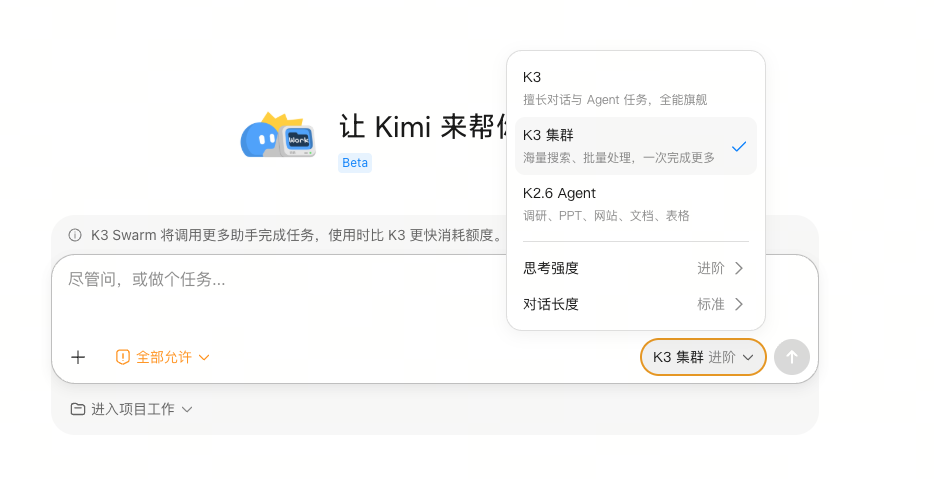

- 进入方式：在work/chat内选择模型的地方选择K3集群模式

- 工作方式为主Agent拉起子agent执行任务

- Agent间通讯 ❌

- 黑箱，看不到每个agent在干什么，用户不可干预，不可以增删子agent，也不可以拉agent进入工作流

## Kimi\-K3 Claw Chat

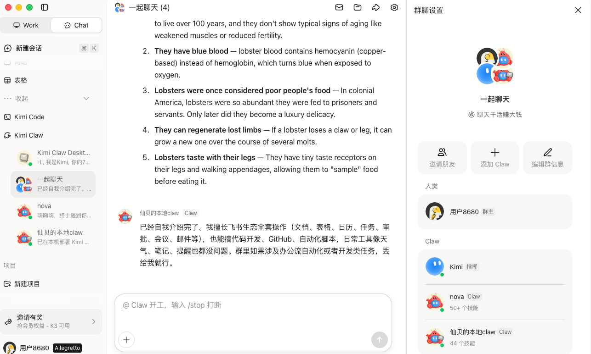

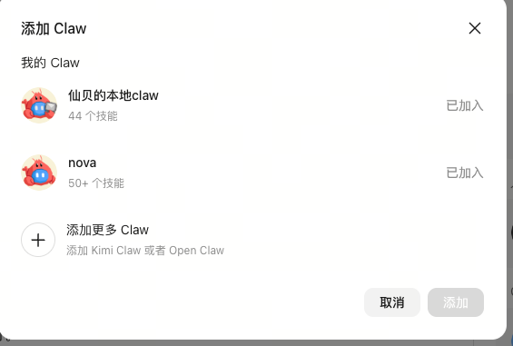

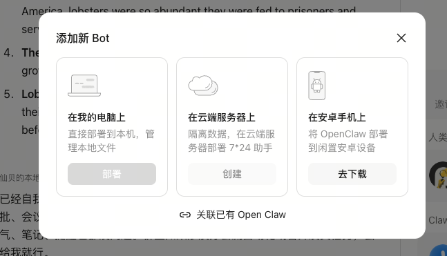

- 进入方式：在chat区进行claw创建和群聊创建

- 可以创建两agent：本地agent，云端agent

- 仅可以把四种agent拉入群聊：用户的kimi本地agent，用户的kimi云端agent，用户的本地openclaw，用户的好友的以上三种agent

- Agent间通讯 ✅

- 与手机端kimiclaw app打通，可以在手机上远程操控（也就意味着可以在手机上远程操控云端和本地agent）

- 用户可干预，可以@负责指挥的“主agent”发布任务，主agent自动把任务分给其他agent，@其他agent干活儿，用户也可以自己@指定任意的agent帮自己完成任务

注：kimi不支持自定义专家，不管是k3swarm还是claw chat都不支持自定义专家组建工作流或者拉入group

## Codex

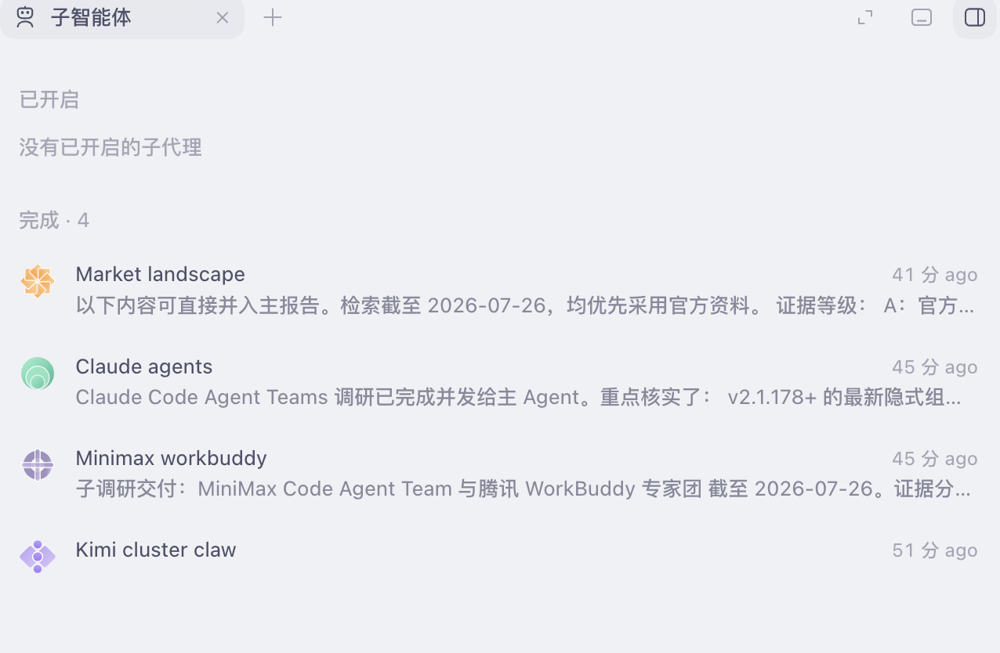

- codex执行任务时调用子agent的工作流如上所示

- 调用方式无需用户任何操作，也无需切换任何的特殊模式，是面对复杂工作时的默认工作流

- 工作方式为主Agent拉起子agent执行任务

- Agent间通讯 ❌

- 黑箱，能看到每个agent在干什么但用户不可干预，不可以增删子agent，也不可以拉agent进入工作流

## workbuddy专家团（更贴合sowork的产品形态）

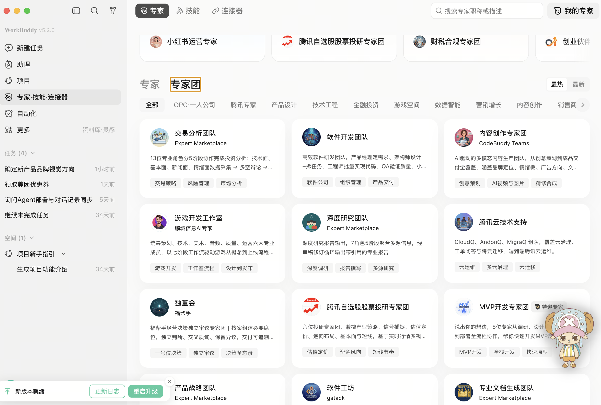

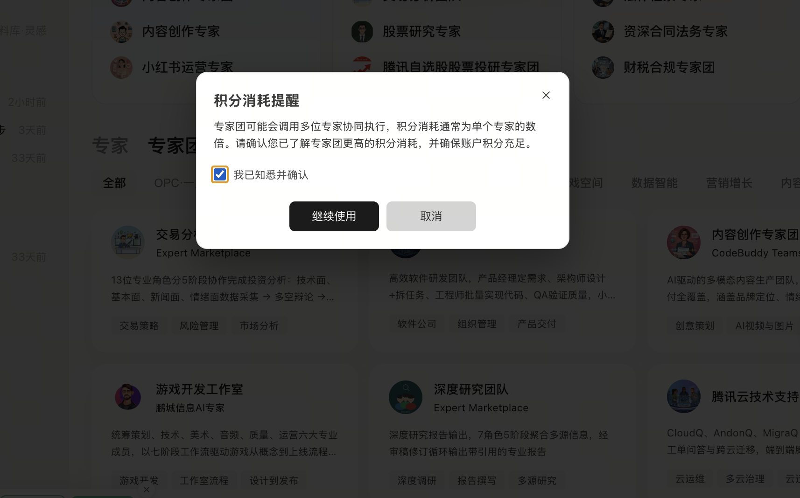

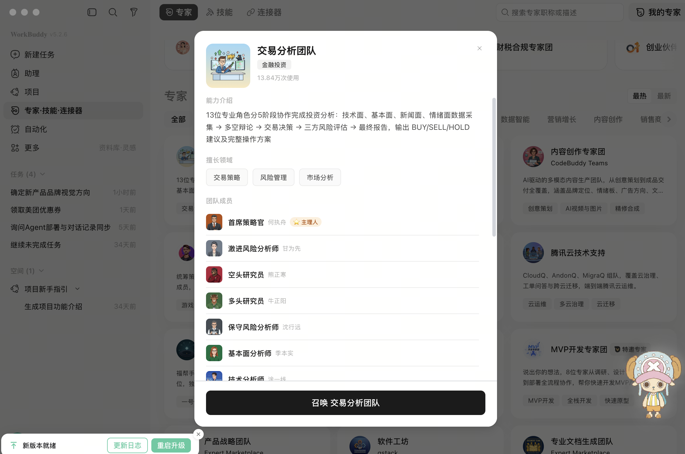

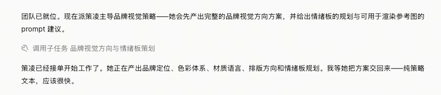

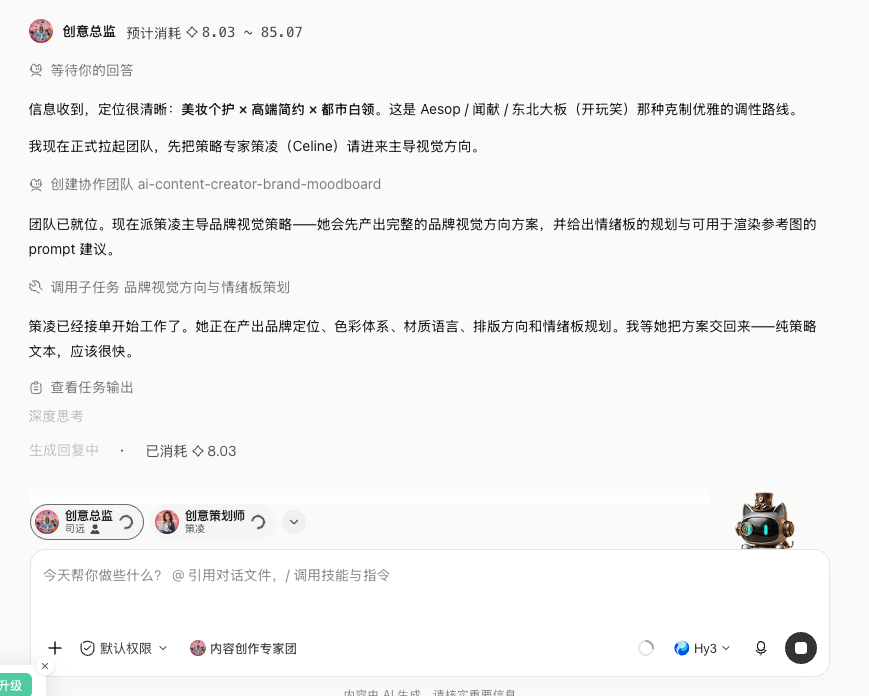

- 系统预设专家团（agent team），用户不可更改，虽然用户可以自己定义专家agent，但是不可自己拉群组专家团

- 调用形式为点击“专家·技能·连接器”，即可选取专家团

- 工作模式为主agent会自己拉起预设团队中的其他团队成员，进行任务分配和协作指挥，类似在kimi claw chat group中@总指挥agent发布任务指令之后的工作流，任何修改意见都会由主agent先接收

- Agent间通讯 ❌

- 各个agent自带人设和“工牌”，活人感很重，用户能看到每个agent在干什么

该模式可以针对每个团队去优化队内skill的效果，workbuddy内部可能有这种设计优化

问题：不能并行，例如在一个代码工程项目中，只有一个工程师agent，代码全由一个工程师开发，量大的话或许应该多拉几个工程师一起干，若同工种可按需多拉几个agent将会更好；

以及当团队内agent角色不能涵盖所有环节需求的时候，可能缺少一些agent角色，若用户能自行拉入或者主agent按需直接创建新agent将会更好。

## Claude code agent team

https://code\.claude\.com/docs/zh\-CN/agent\-teams

https://mp\.weixin\.qq\.com/s/0qdAmD1EplxY7hUULeJ4CA

## Openai swarm

https://github\.com/openai/swarm

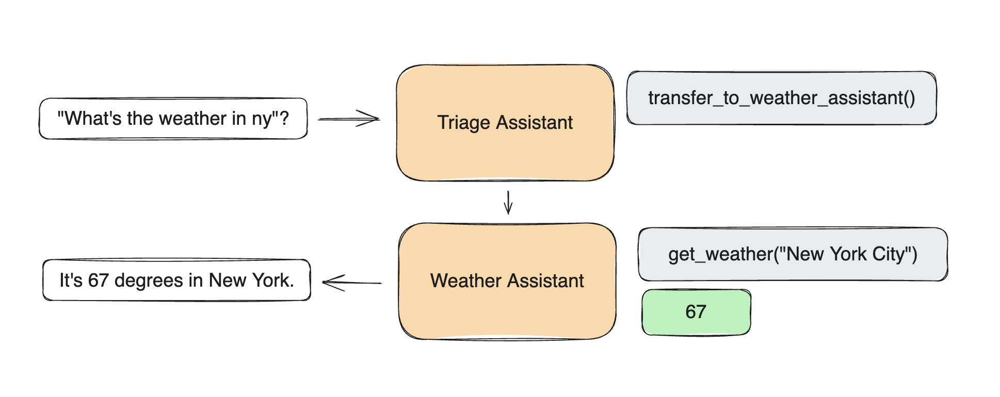

## Openai Agent SDK

https://github\.com/openai/openai\-agents\-python

## Minimaxcode

https://www\.minimaxi\.com/blog/minimax\-agent\-team\-long\-running\-1779893521

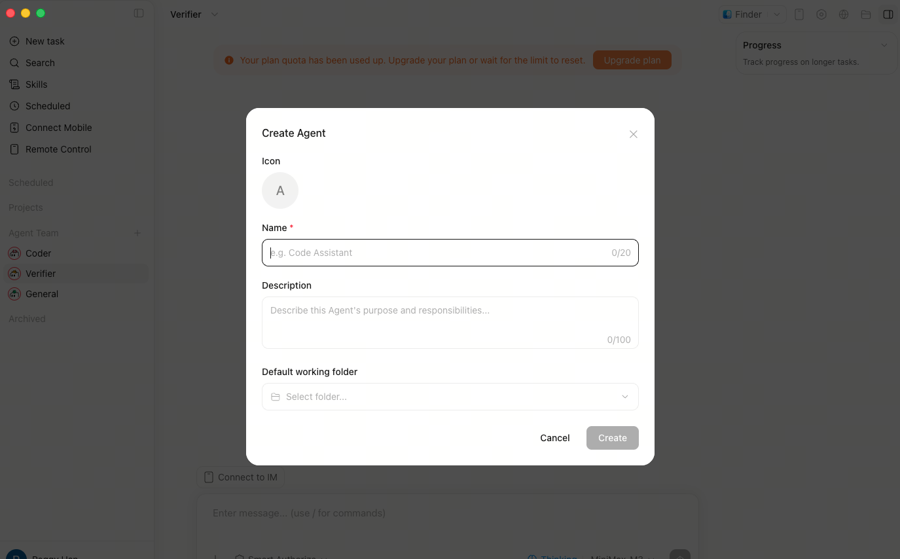

- Minimax agent team更偏向一种技术层面的实现和创新，在用户操作层面并没有给太大的自由度，基本还是主agent拉起，是一种有结构的多Agent并发

- Agent间通讯 ✅

# 一些想法

- workbuddy的专家团模式整体可能更贴合现有的sowork产品形态

- 专家团的好处是用户使用门槛低好上手，劣势是自由度很差，预设模板得有高频使用场景监测数据支撑，并且再怎么做数据监测，预设好的专家团也不可能满足所有的用户需求场景，很难满足个性化需求场景

- 预设团队\+自定义团队的模式？（在预设团队模版的基础上，允许用户自己拉入agent组建个性化工作流，或主agent能够按需创建缺失的agent角色等）

- 一个疑问：为什么目前没有出现这样一种产品形态——用户可以自定义agent，并且将自定义agent自由组队/拉群（chat group）？

    - workbuddy的agent team写的很死，kimi的agent team只能拉个别特定agent，不支持自定义专家agent，主agent拉起其他子agent模式的又大多数为0用户自由度的黑箱
