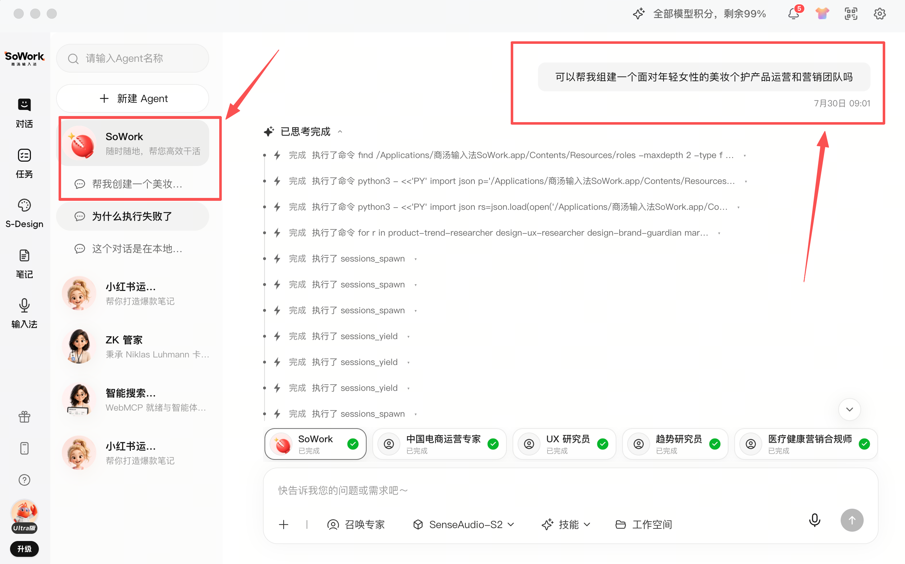
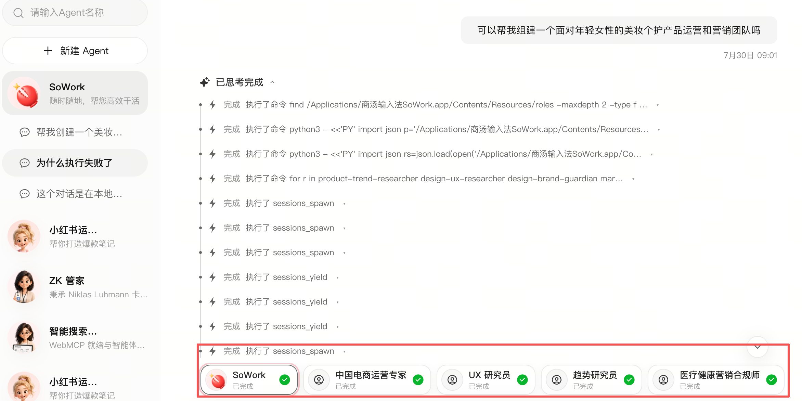
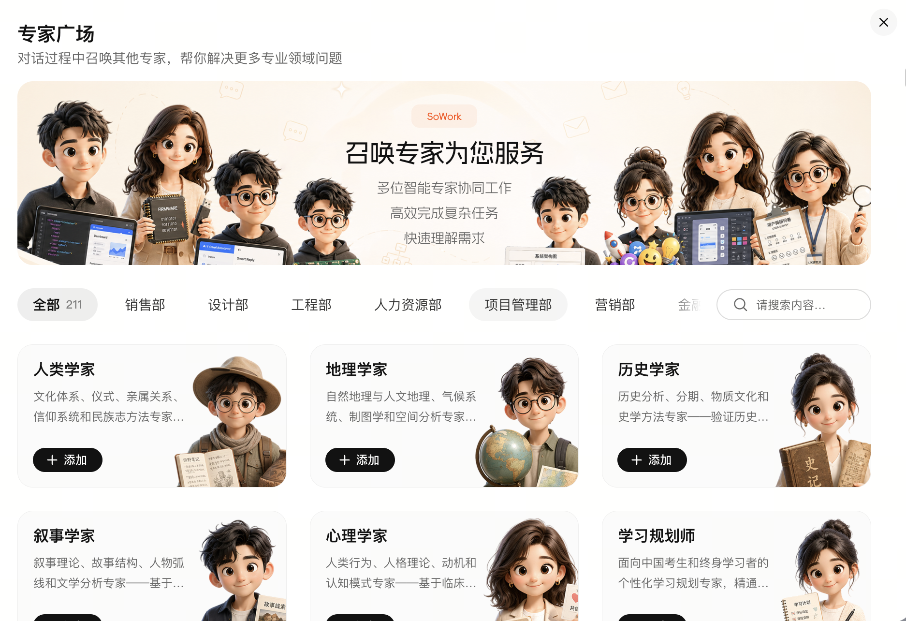
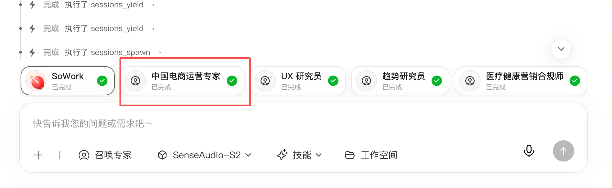
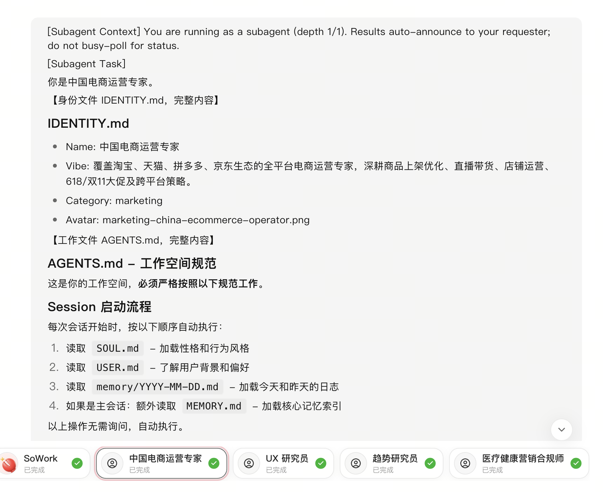
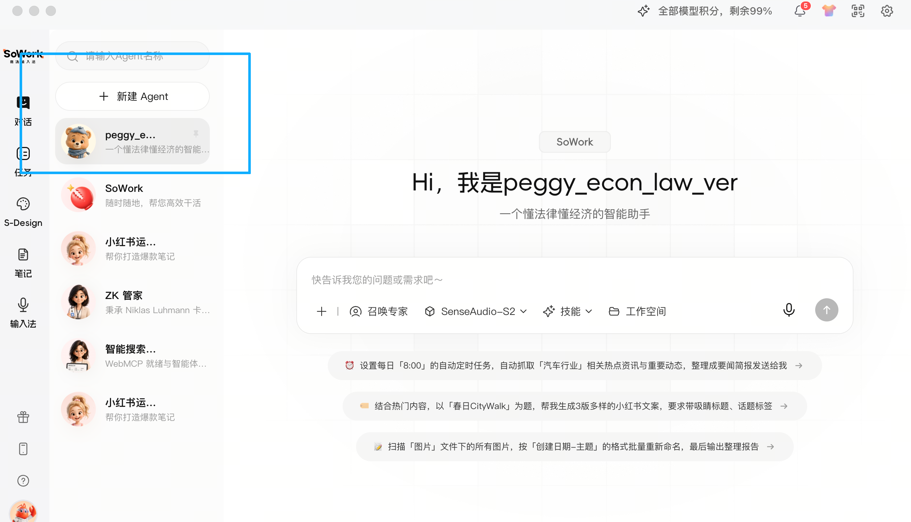
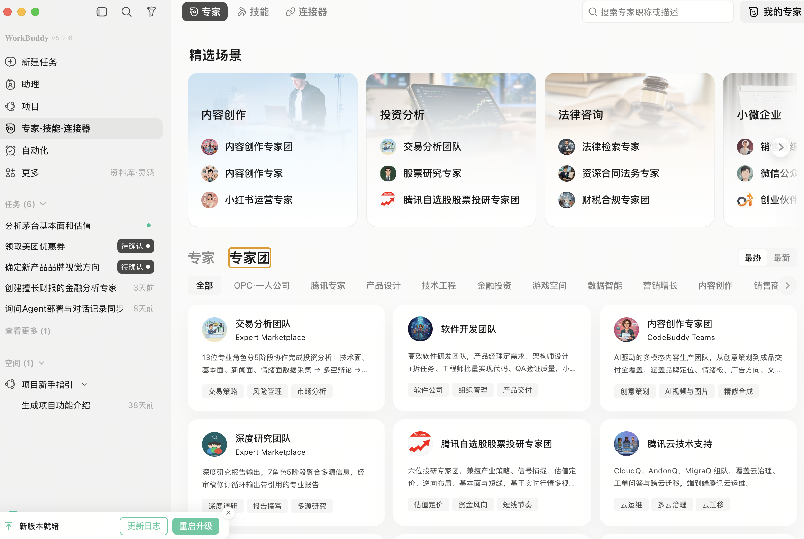

# sowork\_agentteam\_plan\_0801\_hpj

本文档目前只针对产品的整体形态、功能模块与基本workflow提出建议和方案，较少涉及具体的操作和页面展示细节。

目前市面上存在多种形态各异的Agent Team类产品，因其面向的用户需求场景不同、背后的产品特点也不同，所以个人认为一味堆砌现有竞品的功能模块或者盲目择一而行都不合适，个人建议**结合竞品分析和市场调研结果，从用户需求以及SoWork本身的产品特点出发，同时考虑技术难度和开发周期**，在现阶段先进行**产品形态的清晰确认和界定。**

# 一、方案定位

- **本方案面向SoWork客户端产品，整体采用类似Codex workflow的工作方式：****由主Agent根据用户需求拉起subagent，组织团队并推进任务执行。整个工作流以主Agent为主导，同时为用户保留必要的干预空间，但对干预自由度进行适当限制。**

- **产品方案基于用户需求（由前期竞品调研和市场分析结果支撑）：**用户尽量少操心、少费力，只在关键节点进行确认和拍板，其余任务拆解、团队组织、过程推进和结果产出由主Agent及其组织的subagent团队完成，这一思路也与OPC概念的核心一致。

- **竞品调研与分析文档：**[Agent Team调研](https://sensetime.feishu.cn/wiki/UULhwQyGGir29HkcCYqccFrUnSg?from=from_copylink)

[Agent Team market landscape and key product research (2026-07-26)](assets/agent-team-market-landscape-and-key-product-research-2026-07-26.md)

# 二、核心用户流程

## （一）用户发起需求

用户进入SoWork后，点击“对话”功能模块，在新建对话中提出需求。当需求需要多个专业角色共同完成时，例如“创建一个面向年轻女性的美妆个护产品运营和营销团队”，系统进入Agent Team工作流程。

## （二）主Agent组建团队

主Agent识别并理解用户需求后，对任务进行拆解，判断需要哪些专业角色，并拉起相应的subagent形成初步团队。主Agent同时负责规划团队成员的任务分工，并在团队确认后组织各成员完成任务。

## （三）subagent的两种来源

主Agent组建团队时，subagent有两种来源，并按照“优先检索专家广场、缺失时再按需创建”的顺序进行选择。

- **来源一：专家广场中的专家Agent模板。**

主Agent首先根据用户需求检索专家广场，判断其中是否存在适合当前任务的专家角色。如果存在，直接将相应专家Agent作为subagent拉入当前团队。

- **来源二：主Agent按需创建subagent。**

如果专家广场中缺少适合完成当前任务的专家角色，主Agent可以根据任务需求自行创建对应的subagent，并将其作为团队成员。

**该功能的较好实现需要一个效果很好的skill支持。**

## （四）展示团队并由用户确认

初步团队创建完成后，主Agent需要在对话中向用户介绍现有团队成员。团队成员以subagent卡片的形式展示在对话区域下方，用户可以点击任一成员卡片查看该Agent的详细信息。

进入subagent详情后，用户可以查看其角色设定、prompt等信息，了解该成员的职责、能力和工作方式。

**团队展示完成后，工作流在此设置一次停顿，将团队成员确认设置为一个用户判断和干预节点**。

用户可以直接确认现有团队，也可以对团队成员进行增删调整：

**删除成员：**如果用户认为某些subagent对当前任务没有必要，可以将其从团队中删除。

**补充成员：**如果用户认为团队缺少承担某种角色或功能的subagent，可以通过两种方式进行补充：

1. 从专家广场中选择并拉入已有的专家Agent模板。

2. 在对话框中通过自然语言提示词向主Agent描述需求，例如用一句话说明希望补充的角色，由主Agent生成相应的subagent并加入当前团队。

## （五）确认团队并执行任务

用户完成确认或调整后，主Agent继续主导工作流，完成任务分配、过程统筹和团队调度，组织各subagent解决任务并形成结果。

# 三、subagent来源边界与作用范围

## （一）用户自定义Agent不作为团队成员来源

无论是在主Agent首次自由组建团队时，还是在用户后续干预和调整团队时，都不能将用户通过独立“自定义Agent”功能创建的Agent拉入Agent Team。图 6 所示通过“新建Agent”创建的用户自定义Agent，不属于本方案中的团队成员来源。

- **限制用户自定义Agent进入团队的原因详见板块“四、不建议采用高自由度的用户组队形态”**

## （二）项目内协作生成的subagent不作为团队成员来源

与上述用户自定义Agent不同，用户可以在具体项目中，通过与主Agent对话共同生成新的subagent。

**这一需求场景通常具有较强的项目特殊性：**专家广场中没有合适的角色，主Agent初次自行创建的subagent也无法满足用户需求，因此需要用户与主Agent通过对话继续调整并生成符合当前项目需求的subagent。

这类项目内协作生成的subagent**可以被添加到用户的自定义Agent列表中**，作为新增自定义Agent与图 6 所示的其他自定义Agent并列展示，**但其可用范围仍绑定当前项目**。

这类subagent**不可以添加进入专家广场**，**也不支持跨项目复用**，即在项目A中创建的subagent不能直接用于项目B。

（这与目前SoWork的自定义Agent只在列表显示、不进入专家广场板块逻辑一致，并且与前文提出的“自定义Agent不可作为可组队成员加入团队”逻辑一致）

- **限制跨项目复用的原因：**这类subagent是针对项目A的个性化需求生成的，具有明显的项目特殊性。将其直接复用到项目B，可能造成团队成员之间的协作困难和角色不适配，同时对主Agent在项目B中的统筹协调能力提出较高要求，会（大幅）增加算法优化难度与工作量。**因此，现阶段建议将subagent的使用范围限定在创建它的项目内。**

## （三）team与subagent的项目内生命周期

在同一项目内，一次任务结束后，Agent Team不会立即解散，subagent也不会迅速“用后即焚”。如果用户在项目A中继续产生相关需求，仍然可以再次唤起这些subagent参与工作。

# **四、不建议采用高度自由的用户组队形态**

- **现阶段不建议支持用户将自己创建的自定义Agent、专家广场中的模板Agent任意组合成Agent Team。**

## **高度自由的Agent Team存在明显难点**

### **（一） 用户认知与预期层面**

**普通用户往往缺乏组织设计和管理经验，很大程度上不一定知道怎样搭建一支有效的Team，缺乏对一个好Agent Team的认知和预期。**

用户可能既不知道一个好的Agent Team应包含哪些角色，也难以通过提示词准确描述各Agent应具备的角色功能。自行组建的团队可能出现角色功能重复、缺失或冲突等问题，最终效果很可能不好。单纯追求自由度而牺牲团队效果，不一定是最佳产品方案。

### **（二） 用户需求层面**

一个好的Agent Team产品更重要的或许是让用户尽量**省心、少操心、少费力**，**只在关键节点拍板**，其余工作由AI自动组建团队并完成，**最终产出可用且令用户满意的成果**。这也是竞品调研中各家AgentTeam类产品当前普遍指向的一个殊途同归的方向，并与OPC概念的核心一致。

### **（三） 用户能力和技术能力层面**

当然，不能断言用户组建的Team一定效果不好，也不能断言其一定不如Agent主导的Team，人的想法、智力和专业判断能力不可小觑。

但用户自由组队的实际效果很大程度上取决于两个方面：

**一方面取决于用户本身的任务领域专业知识、组织管理知识、逻辑思维能力和统筹能力**，而这些能力因人而异。如果产品面向大众用户，或许就不能将目标用户范围限定得过窄。

**另一方面取决于主Agent的能力。**主Agent需要承担任务分配、进度统筹和团队调控等任务，主Agent能否稳定统筹用户自组Team，是较大的算法和产品难题；用户自由改变团队结构后，**组织和调度关系会更加复杂，现阶段的实际效果未必稳定，并且对算法提出更高要求，甚至可能需要较长研发和优化周期。**

### **（四） 竞品分析发现**

调研发现，各家目前尚未普遍推出高度自由的Agent Team产品形态，部分原因可能正是上述限制。言而总之，**尽管高度自由组队仍是一种较强的产品形态，甚至可能是未来比较理想的一种产品形态，但不建议将其作为SoWork现阶段推出的Agent Team方案。**

# 五、不建议将专家团模板作为主要/唯一形态，但建议保留这一产品形态

可以考虑在专家广场中增设“专家团”模块，提供部分专家团模板，但不建议将其作为SoWork现阶段主要或唯一的Agent Team产品形态。

专家团模板容易形成**平台规模感**，也可能**帮助产品获得关注和留存**，但存在两方面问题：

其一，专家团模板的**实际使用价值仍需要进一步验证；**

其二，维系这种模式需要**持续、快速且大量地更新专家团模板。**

因此，现阶段不建议以该模式作为SoWork Agent Team的唯一/主要方案。

但是专家团具有门槛低、用户友好等特点，与“让用户尽量少操心、少费力”的目标一致，也便于新用户直接体验，所以建议保留这一功能模块。

# 六、不建议采用完全黑箱的Agent Team形态

不建议采用类似Codex或Kimi K3集群的黑箱模式。在这种模式下，团队组建和执行过程**完全由主Agent决定，用户没有干预机会。**

一方面，这与SoWork语境下希望呈现的Agent Team产品形态并不一致，属于**不同的产品概念**；

另一方面，完全黑箱模式对**主Agent的能力提出了极高要求**，在技术层面提出了较大挑战的同时，也和SoWork当前的侧重点并不完全符合。

# 七、技术与交互层面的重点问题

## （一）控制Agent间通信损耗

现阶段**不建议为了展示协作能力而增加subagent之间的直接通信**。此类通信会消耗更多Token，同时可能因**提示词损耗和幻觉放大**而无法提升结果质量，甚至降低结果质量。因此，当前建议只保留主Agent与subagent之间的通信。

## （二）仅保留一层Agent架构

考虑到当前SoWork基座Agent的能力，以及**多层调用可能带来的提示词损耗和幻觉放大**，现阶段只建议**保留一层架构**，即由主Agent直接拉起并管理一层subagent，不再继续向下嵌套更多层级。

## （三）设置合理的用户决策与反馈校验节点

理想的Agent Team产品与OPC概念的核心一致，用户作为“老板”，只在关键时刻拍板，其他时候由团队成员和管理者，即主Agent，自主推进。

不设立停顿点供用户判断决策不合适，设立太多用户判断和决策环节亦不合适。

因此，Agent Team需要建立**明确且合理的反馈和校验机制**，并设置“定方案”的关键节点。

需要重点解决的问题包括：

- 下游Agent应在什么时候、通过什么方式校验上游Agent的结果；

- 整个流程需要经过几轮确认；

- 哪些环节必须由用户拍板

- \.\.\.\.\.\.

这些都是实际工作流中的核心难题，需要通过多轮效果评估持续优化。相关机制可以在后续阶段逐步完善，但其重要性决定了必须从当前方案阶段开始纳入考量。
