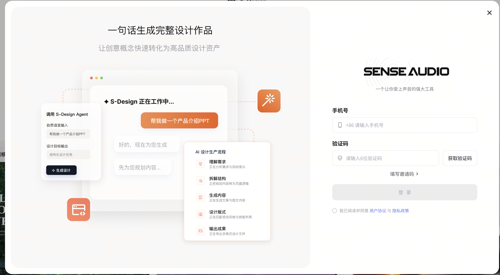
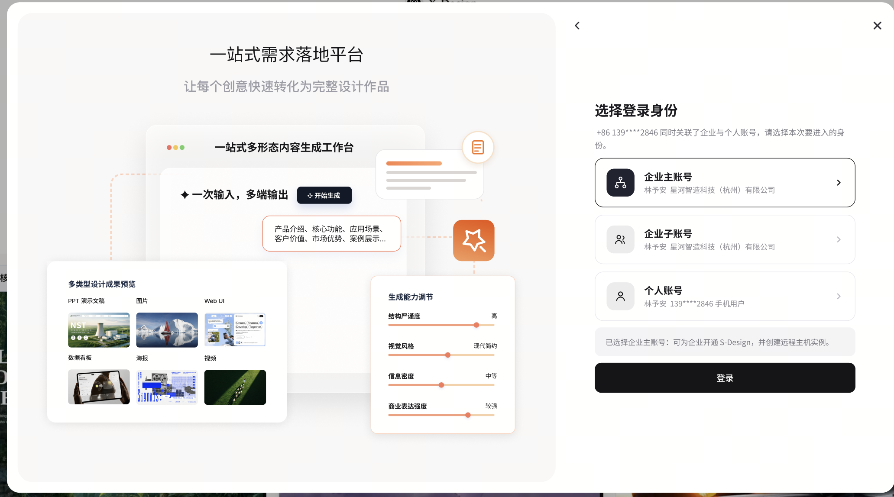
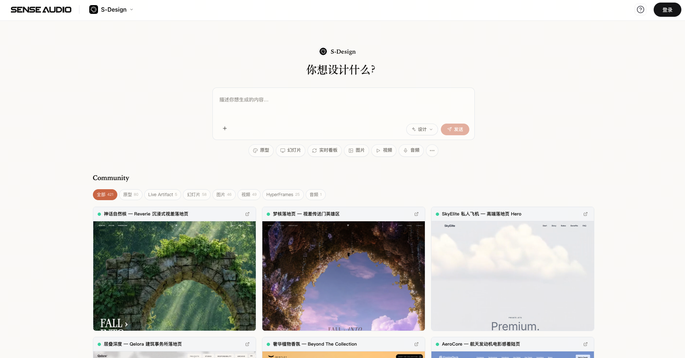
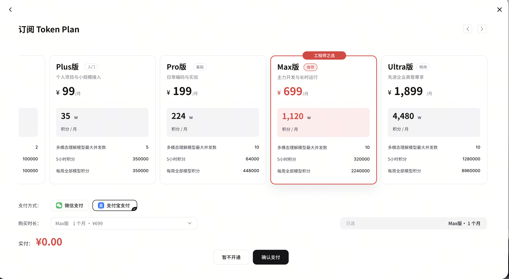
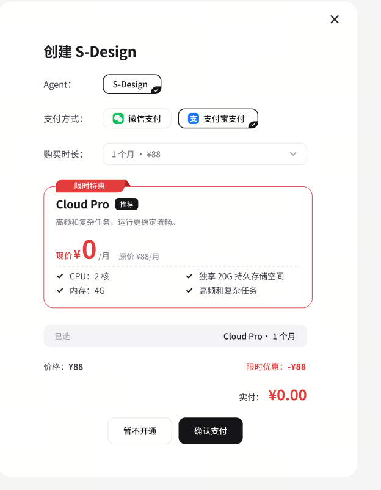
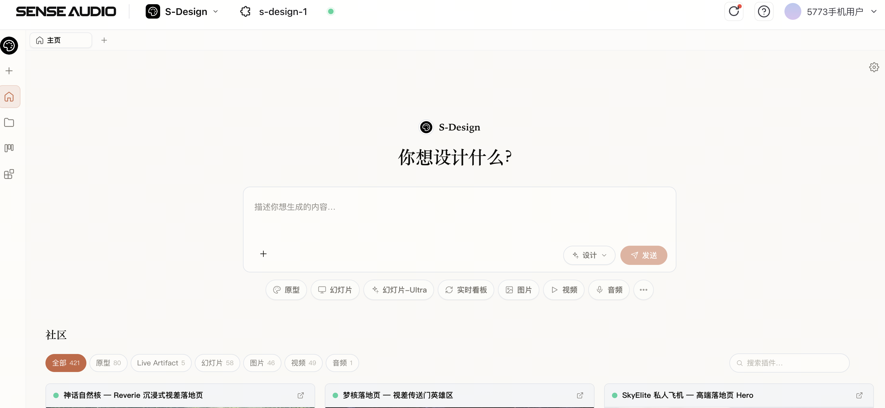
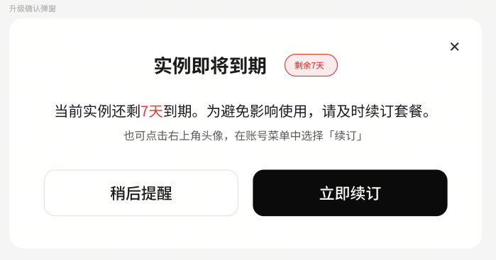
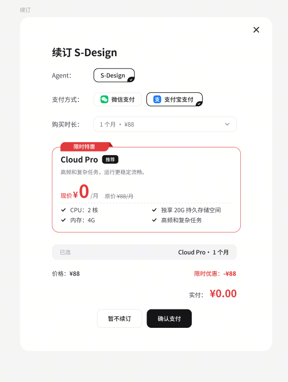
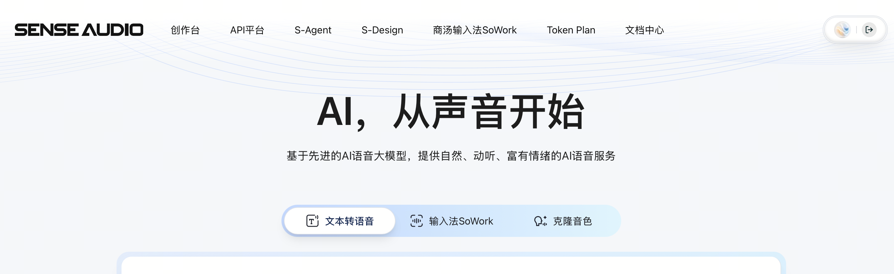
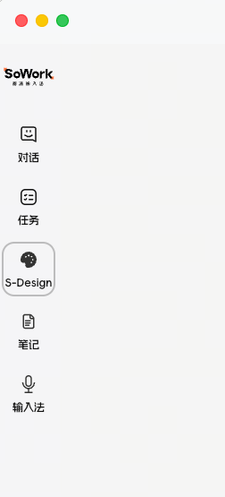

# tokenplan支付逻辑

# 1\. 前言及目标

> 本文用于统一 S\-Design 的登录、Token Plan 引导、实例开通、实例续订及 SoWork 入口判定逻辑，供产品、设计、开发、测试和联调人员共同使用。
>
>

**背景：**S\-Design 使用 Token Plan 和 S\-Design 实例两类独立商品。当前活动希望通过 S\-Design 引导 Token Plan 开通，同时以 0 元支付的方式发放实例开通资格。

**目标：**基于用户登录态、Token Plan 状态、实例状态和实例有效期，给出唯一、可验收的页面与弹窗路径；SoWork 只负责已登录入口和登录态透传，支付与实例判定由 S\-Design 承担。

**范围：**登录与身份选择、Token Plan 引导、实例创建、实例续订、三类访问入口、SoWork 联调、状态数据和验收用例。

## 1\.1 文档变更记录

|更新人|更新时间|更新内容|
|---|---|---|
|@韩佩璟|2026\-07\-13|依据两份 HTML 合并重构登录、支付、续订和 SoWork 入口逻辑；去重并补充状态矩阵、验收用例与待确认事项。|

# 2\. 版本规划

|负责人|需求版本|功能范围|发版版本|发版时间|备注|
|---|---|---|---|---|---|
|待确认|待确认|S\-Design 登录与开通、实例续订、三类入口及 SoWork 联调|待确认|待确认|活动起止时间、灰度范围和恢复原价时间见 Q\-11。|

# 3\. 信息对齐

## 3\.1 脑图/流程图

## 3\.2 总原型图

登录、身份选择、Token Plan、实例创建、实例主页、到期提醒、续订、官网入口和 SoWork 入口的关键界面见“附录 A：关键界面截图”。截图按使用顺序编排，并在图注中标明对应需求章节。

## 3\.3 总设计稿

发版前需由设计负责人补充最终稿，并确认截图中的 Token Plan 实付金额、创建实例页面形态及官网“X\-Design”旧文案。

## 3\.4 功能详解

|规则|产品要求|备注|
|---|---|---|
|独立判定|Token Plan 与 S\-Design 实例独立计费、独立判断。进入时先判 Plan，再判实例。|开通 Token Plan 不等于已创建实例。|
|实例显式开通|活动赠送通过【创建 S\-Design 弹窗】中的 0 元确认支付完成，不静默发放。|0 元流程仍需创建订单并落库。|
|实例套餐|只展示 Cloud Pro，不展示 ¥45 套餐；购买和续订时长固定为 1 个月。|Cloud Pro 原价 ¥88/月。|
|活动价格|实例创建和续订显示限时优惠 \-¥88、实付 ¥0\.00；活动结束后恢复实付 ¥88。|活动时间和配置来源见 Q\-11。|
|支付方式|页面展示微信支付和支付宝支付。|0 元订单的支付渠道要求见 Q\-10。|

|Token Plan|实例|刚完成登录|已登录后再次进入|
|---|---|---|---|
|有|有|直接进入【实例主页】|直接进入【实例主页】|
|有|无|进入【创建实例购买页】，确认 0 元支付后进入【实例主页】|展示【创建 S\-Design 弹窗】，确认后进入【实例主页】|
|无|有|展示【Token Plan 订阅弹窗】；支付、免费开通或暂不开通后进入已有实例的【实例主页】|展示【Token Plan 订阅弹窗】；支付、免费开通或暂不开通后进入已有实例的【实例主页】|
|无|无|先展示【Token Plan 订阅弹窗】；支付或免费开通后进入【创建实例购买页】；两次完成后进入【实例主页】|先展示【Token Plan 订阅弹窗】；支付或免费开通后展示【创建 S\-Design 弹窗】；两次完成后进入【实例主页】|

**兜底原则：**用户点击`暂不开通`不阻断进入。已有实例时进入【实例主页】；没有实例时进入【无实例主页】。在【无实例主页】点击`+ 创建 S-Design`、`发送`或`复刻此内容`，均再次拉起【创建 S\-Design 弹窗】。

## 3\.5 名词定义

|名词|定义|
|---|---|
|Token Plan|平台级模型用量订阅，决定用户可使用的积分额度。包含 Plus、Pro、Max、Ultra 付费档位及免费开通选项；精确有效口径见 Q\-02。|
|S\-Design 实例|使用 S\-Design 所需的远程主机。当前只售 Cloud Pro：2 核 CPU、4G 内存、20G 独享持久存储，常规定价 ¥88/月。|
|实例主页|当前账号已有实例时进入的 S\-Design 首页，Header 展示实例名称与运行状态。|
|无实例主页|用户已登录但没有实例时进入的可浏览页面。Header 显示`+ 创建 S-Design`，输入后点击`发送`或在作品页点击`复刻此内容`也可拉起实例开通。|
|续订提醒期|到期前 7 天内。续订入口开放，每次登录在进入首页前展示到期提醒。|
|冷静期|实例到期后不超过 15 天。实例仍保留，Header 和个人中心续订入口可用；使用权限和提醒规则见 Q\-06。|
|实例清空|实例到期超过 15 天后的状态。下次进入按“无实例”重新判定；清空范围和边界见 Q\-07、Q\-09。|

# 4\. 需求一：S\-Design 登录与开通逻辑

## 4\.1 定义

用户进入 S\-Design 后，系统以当前选择或已登录的身份为判断主体，依次读取登录态、Token Plan 状态和实例状态。未登录用户先完成手机号验证码登录与身份选择；已登录用户跳过这两步，直接进入商品状态判断。

本需求区分两类入口时机：用户刚完成登录后进入，和用户已登录后通过网址、SenseAudio 官网或 SoWork 再次进入。两者的业务分支相同；“有 Plan、无实例”时，前者进入【创建实例购买页】，后者展示【创建 S\-Design 弹窗】。页面与弹窗是否共用组件或路由见 Q\-04。

## 4\.2 显示逻辑

**【登录弹窗】。**展示手机号输入、国家/地区区号、6 位验证码、`获取验证码`、邀请码（非必填）、用户协议勾选和`登录`按钮。用户未填写必要信息或未同意协议时，登录按钮保持禁用。

**【身份选择】。**同一手机号可关联企业主账号、企业子账号和个人账号。用户选择一个身份后继续；企业主账号可为企业开通 S\-Design 并创建实例，其他身份的购买权限和资产归属见 Q\-03。

|界面|必须展示|操作|
|---|---|---|
|【Token Plan 订阅弹窗】|Plus、Pro、Max、Ultra 及免费开通入口；按月价格；套餐卡片；购买时长；微信/支付宝；应付金额|`暂不开通`、`确认支付`；返回和关闭行为见 Q\-05|
|【创建 S\-Design 弹窗】|Agent 固定为 S\-Design；Cloud Pro；2 核/4G/20G；1 个月；原价 ¥88；优惠 \-¥88；实付 ¥0\.00；微信/支付宝|`暂不开通`、`确认支付`；右上角关闭行为见 Q\-05|
|【实例主页】|实例名称、运行状态、创作输入区和社区内容|用户可正常使用 S\-Design|
|【无实例主页】|Header `+ 创建 S-Design`、创作输入区和可浏览的社区内容|点击创建按钮、输入后`发送`、作品页`复刻此内容`均拉起创建实例|

## 4\.3 交互逻辑

**共同登录步骤。**未登录用户触发登录后，按“手机号验证码登录 → 选择身份 → 判断 Token Plan → 判断实例”的顺序执行。状态查询以所选身份为上下文；Plan、订单和实例的资产归属见 Q\-03。

**有 Plan、有实例。**不展示购买弹窗，直接进入【实例主页】。

**有 Plan、无实例。**刚完成登录时进入【创建实例购买页】；已登录后再次进入时展示【创建 S\-Design 弹窗】。点击`确认支付`后创建 0 元订单和实例，再进入【实例主页】；点击`暂不开通`则进入【无实例主页】。

**无 Plan、有实例。**先展示【Token Plan 订阅弹窗】。用户选择付费档、免费开通或`暂不开通`后，均进入已有实例的【实例主页】，不再展示实例购买。

**无 Plan、无实例。**先展示【Token Plan 订阅弹窗】。用户完成付费或免费开通后，继续展示【创建 S\-Design 弹窗】；确认 0 元支付后进入【实例主页】。用户点击任一弹窗的`暂不开通`时，进入【无实例主页】，不自动连弹下一张弹窗。

**无实例兜底入口。**以下三种动作必须拉起同一个【创建 S\-Design 弹窗】：

1. 点击 Header `+ 创建 S-Design`；

2. 在输入区输入内容并点击`发送`；

3. 打开社区作品并点击`复刻此内容`。

## 4\.4 其他逻辑

- Token Plan 和实例状态以当前身份为查询上下文；具体归属模型见 Q\-03。

- 付费档或免费开通 Token Plan 后，无实例用户都可进入 0 元实例创建环节；不得以“未实际付费”为由拦截。

- 实付 ¥0\.00 仍需用户执行`确认支付`，并创建可追溯订单；不得静默创建实例。

- 支付失败、取消、处理中、重复点击、回调失败和实例创建失败的处理方案见 Q\-10。

- 点击`暂不开通`后进入【无实例主页】，不得误判为已开通实例。

# 5\. 需求二：S\-Design 实例续订逻辑

## 5\.1 定义

实例按月到期。系统根据剩余有效期在正常使用期、续订提醒期、冷静期和实例清空四种状态之间切换。创建和续订共用 Cloud Pro、1 个月和活动价格规则，但按钮文案分别为`暂不开通`和`暂不续订`。

|阶段|条件|入口与页面|结果|
|---|---|---|---|
|正常使用期|距到期超过 7 天|Header 不显示续订 icon；个人中心`续订`置灰；登录无提醒|继续使用|
|续订提醒期|到期前 7 天内|三个续订入口开放；每次登录在首页前展示到期提醒|确认续订后延长有效期|
|冷静期|到期后不超过 15 天|实例保留；Header icon 和个人中心`续订`可用|续订后恢复；其他行为见 Q\-06|
|实例清空|到期后超过 15 天|原实例不再按“有实例”处理|下次进入重新走无实例分支|

## 5\.2 显示逻辑

**交互调整。**Header 实例卡片仅展示实例状态，取消点击卡片弹出续订的旧交互；个人中心原`升级/续费`统一改为`续订`。

|续订入口|出现或可点击条件|显示与行为|
|---|---|---|
|个人中心`续订`|提醒期和冷静期可点击；正常使用期置灰|右上角头像 → 个人中心菜单 → `续订`，点击打开【续订 S\-Design 弹窗】|
|Header 续订 icon|提醒期和冷静期显示；正常使用期不显示|位于`使用说明`图标左侧，悬浮提示`立即续订`，点击打开【续订 S\-Design 弹窗】|
|【到期提醒弹窗】|到期前 7 天内，每次登录进入首页前展示|显示剩余天数；`稍后提醒`、`立即续订`及右上角关闭|

**【续订 S\-Design 弹窗】。**展示 Agent、Cloud Pro、2 核/4G/20G、固定 1 个月、原价 ¥88、优惠 \-¥88、实付 ¥0\.00、微信和支付宝；按钮为`暂不续订`和`确认支付`。

## 5\.3 交互逻辑

1. 用户从个人中心、Header icon 或到期提醒点击续订，三种入口落到同一个【续订 S\-Design 弹窗】。

2. 用户点击`确认支付`，系统创建续订订单并更新实例有效期；续订起算点和月度计算规则见 Q\-08。

3. 用户点击`暂不续订`或`稍后提醒`后，保持当前实例状态，不改变到期时间；关闭行为见 Q\-05。

4. 实例到期超过 15 天后被清空；用户下次进入时重新按 Token Plan 和无实例状态判断。

## 5\.4 其他逻辑

- 购买和续订均只支持 Cloud Pro、1 个月；当前活动实付 ¥0\.00。

- 冷静期的使用权限、提醒弹窗和生命周期边界见 Q\-06、Q\-07。

- 实例清空范围、清空前提醒与恢复能力见 Q\-09。

- 续订订单的失败、取消、回调和幂等方案见 Q\-10。

## 5\.5 实例生命周期图

# 6\. 需求三：进入 S\-Design 的三类入口

## 6\.1 定义

|入口|路径|可能的登录态|
|---|---|---|
|S\-Design 网址|直接访问 S\-Design|已登录或未登录|
|SenseAudio 官网|导航栏`S-Design`；首页展示区`立即体验`；作品页`复刻此内容`|已登录或未登录|
|SoWork 客户端|侧边栏`S-Design`|一定已登录|

## 6\.2 显示逻辑

未登录用户打开 S\-Design 时仍可看到输入区和社区内容，Header 显示`登录`，但不能执行需要实例的操作。已登录用户根据 Plan、实例和有效期状态看到【实例主页】、【无实例主页】、【Token Plan 订阅弹窗】、【创建 S\-Design 弹窗】或【到期提醒弹窗】中的一种。

## 6\.3 交互逻辑

**直接访问 S\-Design。**未登录时，点击 Header `登录`、输入后点击`发送`、或在作品页点击`复刻此内容`都会触发完整登录流程。已登录时跳过登录与身份选择，直接判断 Plan 和实例。

**SenseAudio 官网。**未登录用户点击导航栏`S-Design`或`立即体验`后进入完整登录流程；点击作品卡片时允许先查看展示页，点击`复刻此内容`后再登录。已登录用户从以上入口进入时直接判断 Plan 和实例。

**SoWork 客户端。**SoWork 已完成登录，因此点击侧边栏`S-Design`后不得再次展示登录或身份选择。详细规则见第 7 节。

## 6\.4 其他逻辑

- 三个入口进入后的商品判断和实例支付规则必须一致，差异只在是否需要登录、身份选择及首次页面形态。

- 官网展示区截图中出现“X\-Design”文案，疑似旧稿或笔误；正文与上线素材统一使用“S\-Design”，最终文案需设计确认。

- 未登录可浏览不代表可使用。所有实际创作和复刻动作必须先完成登录、身份选择和商品判断。

# 7\. 需求四：SoWork 入口支付逻辑

## 7\.1 定义与系统边界

SoWork 提供侧边栏入口并向 S\-Design 传递有效登录态，不感知 Token Plan、实例状态或有效期，也不决定首屏。S\-Design 在每次从 SoWork 进入时重新查询当前账号状态，按 Plan → 实例 → 有效期的顺序处理。

从 SoWork 进入时，如果仍出现【登录弹窗】或【身份选择】，判定为登录态透传或账号映射问题。跳转 URL、Deep Link、SSO 协议、账号映射方式和超时兜底见 Q\-12。

## 7\.2 显示逻辑

|Plan / 实例状态|进入后的首屏|完成后的页面|
|---|---|---|
|有 Plan、有实例|无购买弹窗|【实例主页】；若处于提醒期，首页前先展示【到期提醒弹窗】|
|有 Plan、无实例|【创建 S\-Design 弹窗】|确认后进入【实例主页】；点击`暂不开通`后进入【无实例主页】|
|无 Plan、有实例|【Token Plan 订阅弹窗】|支付、免费开通或点击`暂不开通`后进入已有实例的【实例主页】|
|无 Plan、无实例|先【Token Plan 订阅弹窗】，完成后再展示【创建 S\-Design 弹窗】|两次确认后进入【实例主页】；任一`暂不开通`后进入【无实例主页】|

## 7\.3 交互逻辑

1. 用户在 SoWork 侧边栏点击`S-Design`。

2. S\-Design 校验登录态；校验通过后，不展示登录和身份选择。

3. S\-Design 查询当前账号的 Token Plan；无 Plan 时先展示【Token Plan 订阅弹窗】。

4. S\-Design 查询实例；无实例时展示【创建 S\-Design 弹窗】。

5. 已有实例时继续判断实例有效期；提醒期先展示到期提醒，冷静期保留续订入口，清空后按无实例处理。

**弹窗顺序不可颠倒。**无 Plan、无实例必须先展示【Token Plan 订阅弹窗】，再展示【创建 S\-Design 弹窗】；有 Plan、无实例只展示创建实例；无 Plan、有实例只展示 Token Plan。

**首屏差异属于预期。**同一用户在不同时间从 SoWork 进入，可能看到【实例主页】、【Token Plan 订阅弹窗】、【创建 S\-Design 弹窗】或【到期提醒弹窗】；SoWork 不应根据这些状态调整入口行为。

## 7\.4 其他逻辑与联调依赖

下表是建议的职责拆分，需在技术评审中确认实际服务边界、接口和错误处理。

|依赖方|要求|待补充|
|---|---|---|
|SoWork|提供入口并传递有效登录态；每次点击允许 S\-Design 重新判断|跳转地址、SSO/Deep Link、Token 生命周期、失败兜底|
|S\-Design|按固定顺序请求状态并展示页面；不得重复展示登录；处理暂不开通和补开入口|加载中、接口失败、超时和重试体验|
|Token Plan 能力|提供当前身份的 Token Plan 状态|有效、免费、到期、冻结和欠费口径|
|实例能力|提供实例状态和到期时间，并支持创建、续订与结果回查|状态枚举、创建耗时、失败补偿和幂等|
|订单与支付能力|支持实例 0 元正式订单、活动价恢复和结果回查|0 元渠道要求、回调、超时、取消、重复提交|

## 7\.5 联调 Checklist

* [ ] SoWork 登录用户进入后不再出现【登录弹窗】或【身份选择】。

* [ ] 每次点击 SoWork 入口均由 S\-Design 重新读取 Plan、实例和有效期状态。

* [ ] SoWork 不传递或缓存 Plan、实例和有效期状态，不根据业务状态改变入口。

* [ ] 登录态失效、账号映射失败和跳转超时按 Q\-12 的确认结论处理。

# 8\. 数据需求

## 8\.1 业务状态数据

以下为实现判定逻辑所需的概念数据，不是接口字段名；字段、枚举和归属服务需经技术评审确认。

|数据|用途|口径要求|
|---|---|---|
|登录态与当前身份|决定是否展示登录，并作为状态查询上下文|建议区分企业主、企业子账号和个人账号；资产归属见 Q\-03|
|Token Plan 状态|决定是否展示订阅弹窗|需定义有效、免费、到期、冻结、欠费等状态如何归类|
|实例状态|决定主页、创建弹窗和续订入口|建议区分无实例、正常、提醒期、冷静期、已清空；运行状态是否单独返回由技术评审确定|
|实例到期时间|计算剩余天数、提醒期和清空时间|统一时区、自然日或精确时刻、边界包含关系|
|活动价格配置|控制原价、优惠和实付|建议包含活动时间、适用人群、账号限额和恢复策略；见 Q\-11|
|订单与实例结果|完成开通、续订和结果回查|0 元订单需要可追溯；具体订单号、结果状态和幂等字段见 Q\-10|

## 8\.2 建议埋点（待确认）

|事件|触发时机|建议公共字段|
|---|---|---|
|S\-Design 入口点击|网址、官网或 SoWork 入口被触发|source\_entry、login\_state、account\_type|
|商品状态判定|Plan 和实例查询完成|plan\_state、instance\_state、instance\_expire\_at、result|
|Token Plan 弹窗曝光/操作|弹窗展示、确认、免费开通、暂不开通或关闭|plan\_sku、action、pay\_amount、source\_entry|
|实例创建弹窗曝光/操作|页面或弹窗展示、确认、暂不开通或关闭|trigger、instance\_sku、action、pay\_amount|
|订单结果|Token Plan、实例创建或续订完成|product\_type、order\_id、result、error\_code、duration|
|实例结果|实例创建、续订或清空完成|instance\_id、action、result、error\_code|
|续订提醒曝光/操作|提醒、Header icon 或个人中心入口曝光和点击|renew\_entry、days\_remaining、action、instance\_state|

## 8\.3 数据结论

上线观察周期、核心指标和目标值待确认。建议观察各入口进入量、Token Plan 弹窗转化、实例 0 元开通完成率、暂不开通率、实例创建成功率、续订完成率，以及 SoWork 入口的登录态透传失败率；是否纳入发版验收由数据口径评审决定。

# 9\. 验收标准

|编号|前置条件|操作|期望结果|
|---|---|---|---|
|AC\-01|未登录|点击登录、发送或复刻|依次展示登录、身份选择和商品状态判断|
|AC\-02|有 Plan、有实例|进入 S\-Design|不展示购买弹窗，进入实例主页|
|AC\-03|有 Plan、无实例|已登录后进入|只展示创建实例；确认后建单和实例，暂不开通后进入无实例主页|
|AC\-04|无 Plan、有实例|进入并操作 Token Plan 弹窗|支付、免费开通或暂不开通后均进入已有实例主页|
|AC\-05|无 Plan、无实例|完成 Token Plan 付费或免费开通|继续展示创建实例；0 元确认成功后进入实例主页|
|AC\-06|无实例主页|分别点击创建、发送、复刻|三种动作均拉起同一个创建实例弹窗|
|AC\-07|任一实例创建或续订界面|检查商品字段|只显示 Cloud Pro、1 个月、¥88、优惠 \-¥88、实付 ¥0\.00，不显示 ¥45 套餐|
|AC\-08|距到期超过 7 天|进入首页并查看个人中心|无提醒，Header 无续订 icon，个人中心`续订`置灰|
|AC\-09|到期前 7 天内|登录进入 S\-Design|首页前展示提醒；三个续订入口可用并落到同一续订弹窗|
|AC\-10|到期后不超过 15 天|从 Header 或个人中心续订|可打开续订弹窗，成功后恢复实例；其他冷静期行为以确认结论为准|
|AC\-11|到期后超过 15 天|再次进入 S\-Design|原实例按已清空处理，并重新进入无实例分支|
|AC\-12|SoWork 已登录|点击侧栏 S\-Design|不展示登录和身份选择；每次重新判定 Plan、实例与有效期|

# 10\. 待确认事项

|编号|事项|影响|结论/负责人|
|---|---|---|---|
|Q\-01|Token Plan 正文价格与截图实付 ¥0\.00 冲突；Token Plan 是否参与 0 元活动？|价格展示、订单金额、验收口径|待确认|
|Q\-02|“有 Token Plan”的定义是否包含免费、试用、到期、冻结或欠费状态？|弹窗分支|待确认|
|Q\-03|Plan、订单和实例归属于手机号、企业、企业主、子账号还是个人账号？|身份选择、资产与权限|待确认|
|Q\-04|【创建实例购买页】与【创建 S\-Design 弹窗】是否共用组件或路由，设计稿如何对应？|前端实现与设计验收|待确认|
|Q\-05|Token Plan、创建和续订弹窗的关闭/返回是否等同于暂不开通或暂不续订？|兜底路径|待确认|
|Q\-06|冷静期能否继续使用实例，进入时是否继续展示到期提醒？|到期体验|待确认|
|Q\-07|到期日、7 天和 15 天按自然日还是精确时刻计算，使用哪个时区？|生命周期边界|待确认|
|Q\-08|续订后从原到期日顺延一个月，还是从支付成功时重新计算？|有效期计算|待确认|
|Q\-09|实例清空的范围、触发时刻、清空前提醒及恢复能力是什么？|数据安全与客服|待确认|
|Q\-10|0 元订单是否需要支付渠道；失败、取消、超时、回调和幂等如何处理？|支付链路稳定性|待确认|
|Q\-11|活动起止时间、灰度人群、每个账号可领实例数量和重复领取限制是什么？|活动配置与风控|待确认|
|Q\-12|SoWork 跳转地址、SSO/Deep Link、账号映射、登录态过期和超时兜底方案是什么？|跨端联调|待确认|

# 附录 A：关键界面截图

截图提供与登录、支付、续订和入口判断直接相关的界面；

截图中的样例金额、套餐权益和账号信息不得替代正文规则。

