# senseaudio图片视频生成页面修改需求

本期评审主要对上线版本（下文1\-8部分）进行评审，不涉及产品功能和结构的重大调整，主要涉及页面优化；第9部分提及的内部团队版本为功能开发的可行性与必要性初步探讨，暂不作细致需求评审。

更：经评审，第9部分功能开发暂不做考虑

# 1\. 需求背景与范围

本次需求用于说明 SenseAudio 图片/视频生成页面整体视觉设计与交互的重构内容。图 1 为原版本页面，图 2 为当前版本页面。本轮主要整理创作输入框、素材中心、素材卡片与详情页，以及“我的创作”模块的变化和具体交互要求。

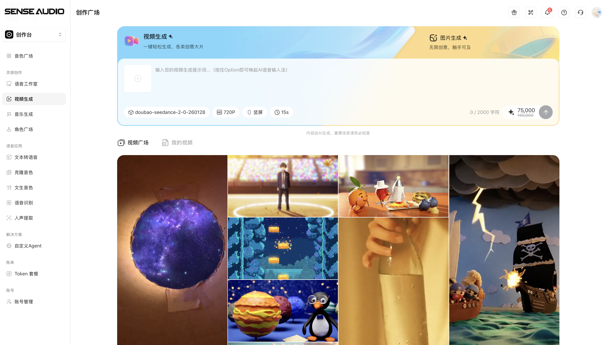

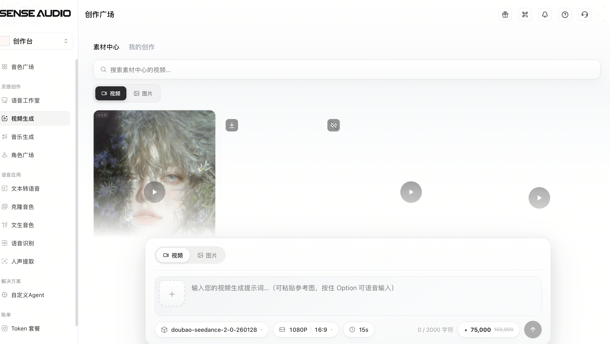

# 2\. 版本变更对照总览

|模块|原版本|当前版本及修改要求|变化情况|
|---|---|---|---|
|页面进入弹窗|无|不设置页面进入弹窗，用户打开页面后直接进入主页内容。|无变化|
|页面整体|页面布局及视觉效果如图 1 所示。|页面整体布局及视觉效果调整为图 2 所示。|有变化|
|创作输入框位置|输入框位于页面上方内容区域，见图 3。|输入框移动至页面下方并固定，不随页面滚动；输入框背后增加蒙版和渐变效果，见图 4。|有变化|
|创作输入框功能|支持现有的图片/视频生成相关功能，不可通过粘贴图片的方式上传参考图。|除新增 AI 内容提示外，其他生成能力不变，仅调整布局、视觉样式和部分交互方式。 功能优化：可以通过粘贴方式上传图片|功能略有变化 |
|视频/图片切换|通过点击输入框上方的“视频生成/图片生成”卡片进行切换，见图 8。 |改为通过输入框内的“视频/图片”切换按钮进行切换，视频按钮位于左侧、图片按钮位于右侧；用户首次进入页面时默认停留在视频生成功能，视频按钮处于选中态，并显示视频模型、分辨率与比例、时长及视频积分，见图 7。|交互变化|
|比例与尺寸选择|在输入框底部以参数项形式展示。 |图片参数按钮仅显示比例，不显示具体尺寸；视频参数按钮使用视频图标，并按“分辨率 \| 比例”的顺序同步展示所选清晰度和横竖屏比例。|有变化|
|素材中心|原页面直接展示素材内容。|增加搜索、视频/图片类型筛选按钮、素材卡片悬停操作及详情信息弹窗。视频按钮在前且默认选中；搜索仅作用于当前选中的素材类型。|有变化|
|我的创作|原版本未包含当前形式的“我的创作”模块。|增加“我的创作”模块，用于展示生成任务和历史作品；模块内使用与素材中心一致的视频/图片分区筛选，生成任务自动进入对应类型。|新增模块|

# 3\. 创作输入框修改需求

## 3\.1 位置与视觉样式

原版本输入框如图 3 所示，当前版本输入框如图 4 所示。输入框从页面上方移动至页面下方，并固定在页面底部，不随页面内容滚动。输入框背后增加蒙版和渐变效果，用于处理输入框与下方素材展示区域之间的视觉衔接。

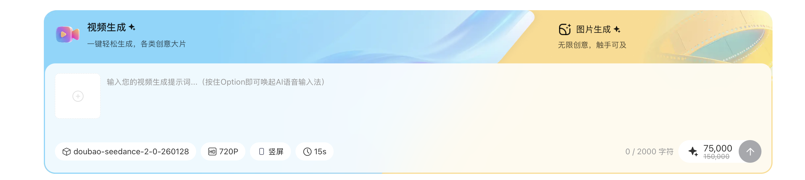

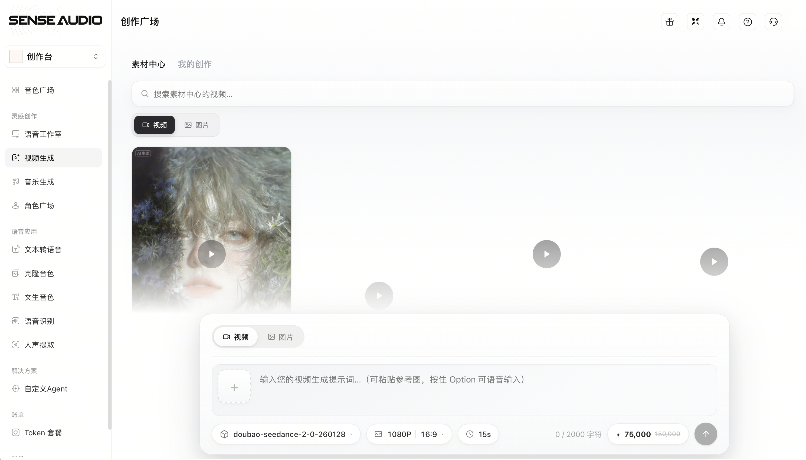

## 3\.2 收起与展开交互

1. 当用户向下滚动页面、查看下方素材展示卡片时，输入框收起为一条简化状态，效果如图 5 所示。

2. 当用户点击收起后的条形区域时，输入框展开为完整状态，效果如图 6 所示；仅将鼠标移入该区域不会触发展开。

3. 输入框点击展开后，如果用户仅将鼠标移出输入框区域，输入框不立即收起，继续保持完整展开状态。

4. 只有在用户鼠标已经移出输入框区域，并再次滚动鼠标滚轮时，输入框才重新收起为条形状态。即“鼠标移出输入框区域”和“滚动滚轮”两个条件需同时满足。

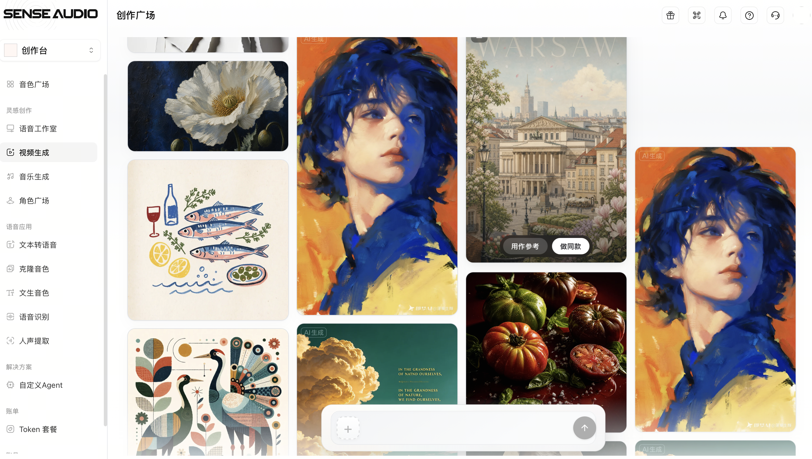

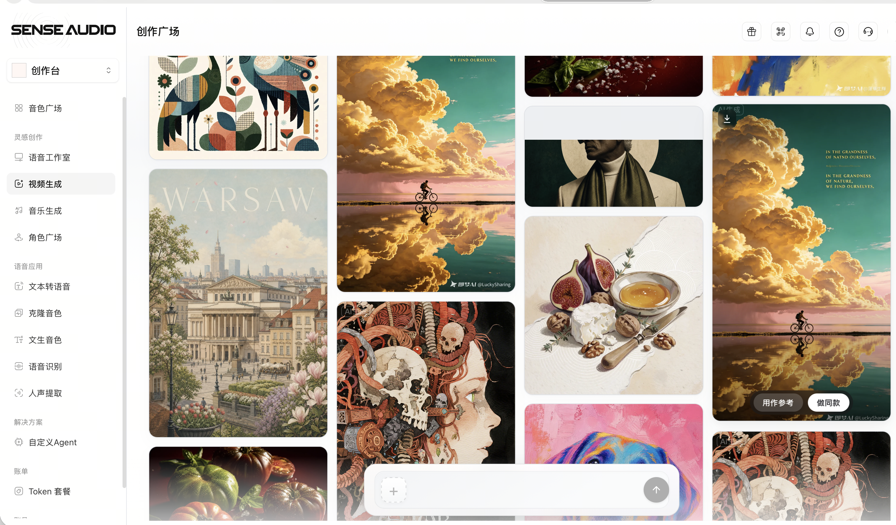

## 3\.3 输入框功能与视频/图片切换

当前输入框细节如图 7 所示，原输入框如图 8 所示。与原版本相比，除新增 AI 内容提示外，其他生成能力不变。图片生成与视频生成的切换方式发生变化：原版本通过点击输入框上方的“视频生成/图片生成”卡片进行切换；当前版本改为通过输入框内的“视频/图片”切换按钮进行切换，其中视频按钮位于左侧，图片按钮位于右侧。

用户首次进入页面时默认处于视频生成模式：视频按钮高亮，提示词文案、模型、分辨率与比例、时长及积分均显示视频生成对应内容；用户点击图片按钮后再切换为图片生成模式。

提示词输入区域右下方常驻展示辅助说明“内容由AI生成，重要信息请务必检查”。该提示使用弱提示样式，与提示词输入内容分层展示，不遮挡可输入内容；输入框收缩为精简状态时，提示随输入主体隐藏，重新展开后恢复显示。图片生成和视频生成模式均使用同一文案。

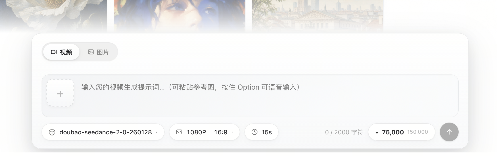

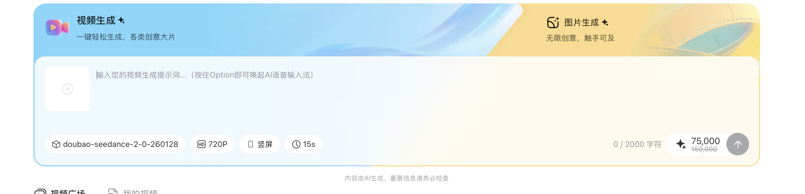

## 3\.4 图片/视频比例选择展示框

输入框下方的图片参数按钮仅显示当前比例，不显示具体尺寸。图片比例下拉菜单仍按比例选择。视频参数按钮使用视频图标，并按“分辨率 \| 比例”的顺序显示当前选择（如“720P \| 16:9”）；选择横屏/竖屏或清晰度后，按钮同步更新。

图片生成参数的对外展示不再显示具体尺寸，仅保留比例；实际生成尺寸继续作为内部参数使用，不面向用户展示。

图 9 和图 10 仅作为当前阶段的占位参考，相关展示框后续以设计稿为准。

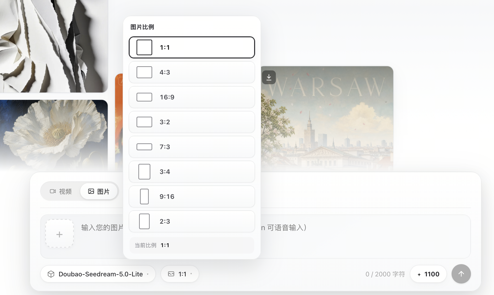

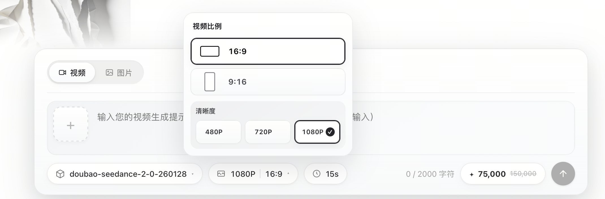

## 3\.5 粘贴图片上传

功能优化：可以通过在输入框内粘贴图片的方式进行参考图片上传。

# 4\. 素材中心修改需求

## 4\.1 搜索与类型筛选

素材中心增加搜索框，位置和样式如图 11 所示。搜索用于检索素材中心的作品：系统只在当前选中的素材类型内，将用户输入内容与素材对应的提示词进行匹配，并根据匹配结果展示素材。

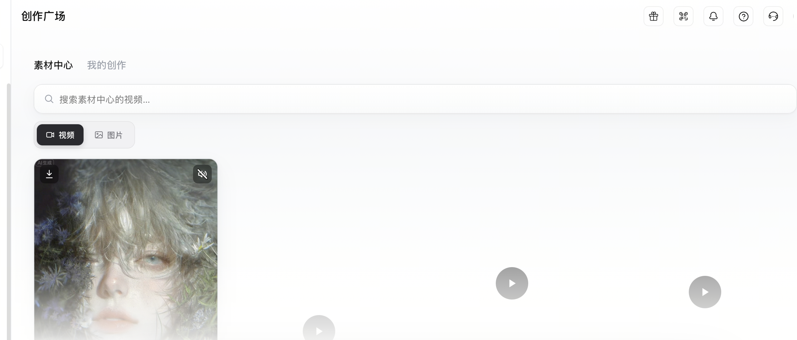

搜索框下方设置“视频”和“图片”两个独立的单选筛选按钮，不再作为搜索标签，也不将已选项以卡片形式写入搜索框。按钮顺序为视频在前、图片在后；用户打开页面时默认选中视频并仅展示视频素材。点击图片后切换为仅展示图片素材，再次点击视频则切回视频素材。搜索始终只在当前选中的类型内生效。

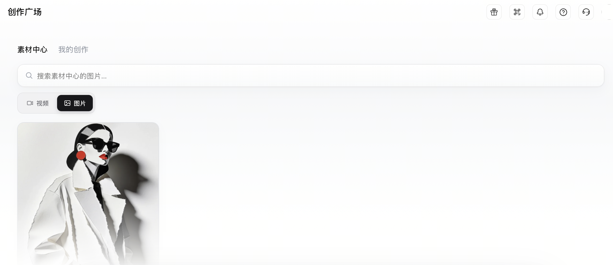

## 4\.2 图片素材卡片悬停交互

当用户将鼠标移入类型为图片的素材卡片时，卡片展示图 13 所示的悬停操作：

- 卡片左上角显示下载按钮，点击后下载当前图片。

- 卡片下方显示“用作参考”和“做同款”两个按钮。

- 点击“用作参考”，将当前图片作为参考图回填到创作输入框。

- 点击“做同款”，仅将当前图片对应的提示词回填到创作输入框。

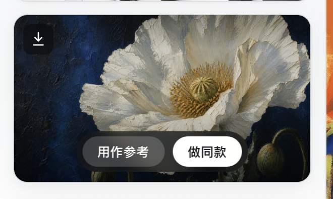

## 4\.3 图片素材详情弹窗

点击图片素材卡片后，打开图 14 所示的详情信息弹窗。

**左侧素材展示区域。**素材在左侧区域居中展示；展示区域左右两侧提供切换按钮，用户可以点击查看上一个或下一个素材。区域下方展示素材缩略图列表，缩略图支持左右滑动；点击缩略图可直接跳转至对应素材，当前素材默认在缩略图行的中间位置；当前正在查看的素材缩略图需通过框选样式进行着重显示。

**右侧详情信息区域。**右侧展示当前素材的详情信息，包括创意描述、模型、图片比例和生成时间。生成时间统一精确到年月日并按 YYYY\-MM\-DD 展示；图片详情不展示清晰度或具体尺寸。创意描述即当前素材对应的提示词，旁边提供复制图标，点击后复制提示词。

**底部操作。**详情区域下方提供“做同款”和“用作参考”两个按钮。“做同款”用于回填当前素材的提示词；“用作参考”用于将当前图片作为参考图回填到创作输入框，功能与图片卡片悬停状态下的同名按钮一致。

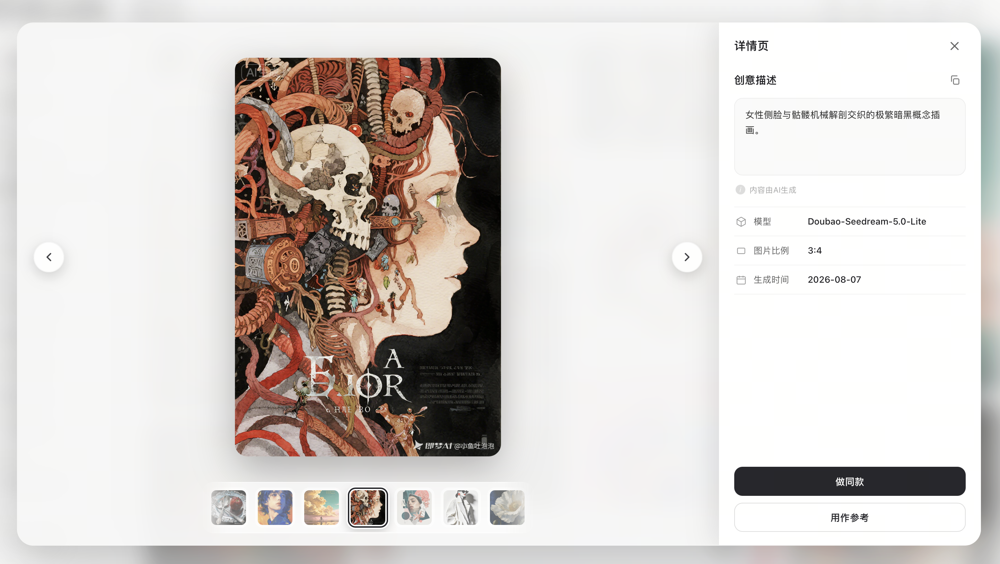

**若图片生成有参考图片**

当作品数据中存在参考图时，在创意描述下方展示参考图缩略图（如图15所示）；无参考图时不展示该区域。

点击缩略图后，在当前详情弹窗范围内打开参考图预览层，虚化整个详情弹窗背景，并将参考图以圆角形式居中完整展示，右上角提供下载和关闭按钮，同时支持点击遮罩或按 Esc 关闭。（如图16所示）

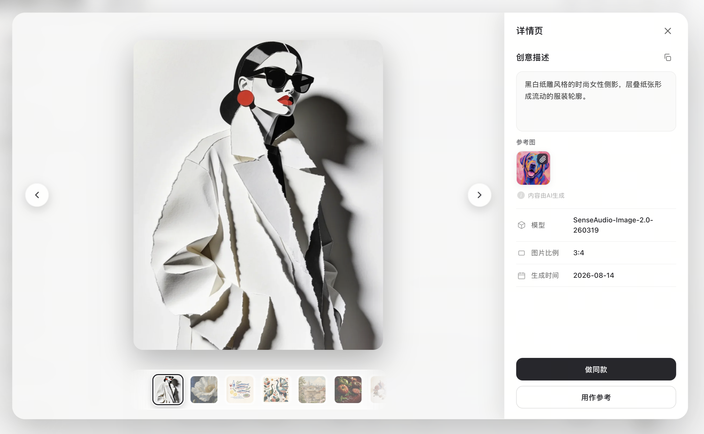

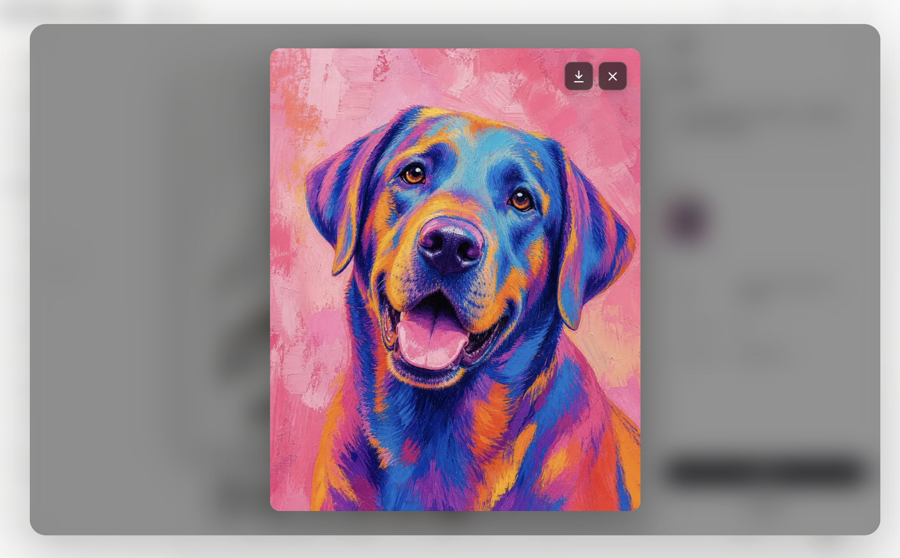

## 4\.4 视频素材卡片悬停交互

当用户将鼠标移入类型为视频的素材卡片时，卡片展示图 17 所示的悬停操作：

- 卡片左上角显示下载按钮，点击后下载当前视频。

- 卡片右上角显示声音开关按钮，用于控制当前视频的声音开启或关闭。

- 卡片下方仅显示“做同款”按钮，点击后将当前视频对应的提示词回填到创作输入框。

- 视频素材不提供“用作参考”及参考素材视频回填交互。

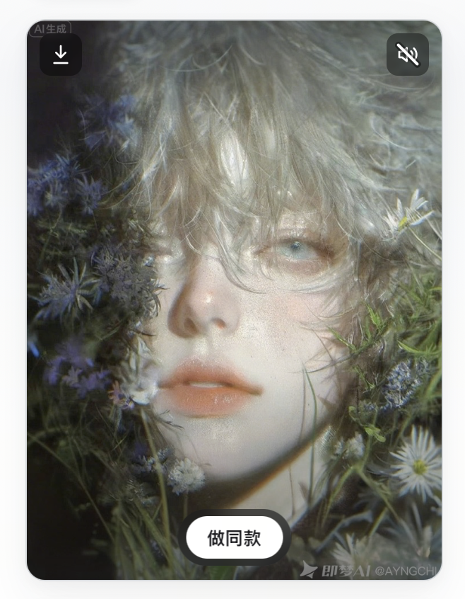

## 4\.5 视频素材详情弹窗

点击视频素材卡片后，打开图 18 所示的详情信息弹窗。弹窗整体结构与图片素材详情弹窗保持一致：左侧为素材展示和切换区域，下方为可点击跳转的缩略图列表，右侧为详情信息区域。

视频详情信息包括创意描述、模型、分辨率、视频比例、视频时长和生成时间。生成时间统一精确到年月日并按 YYYY\-MM\-DD 展示。创意描述即当前视频对应的提示词，旁边提供复制图标。左侧视频展示区域右上角增加静音按钮，用于控制视频声音。

视频详情弹窗下方仅提供“做同款”按钮，用于回填当前视频的提示词；不提供“用作参考”按钮及参考素材回填交互。

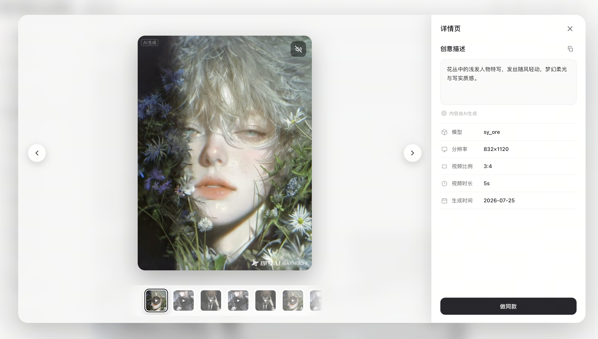

**若图片生成有参考图片**

同4\.3有参考图时的情况，如图19\-20所示

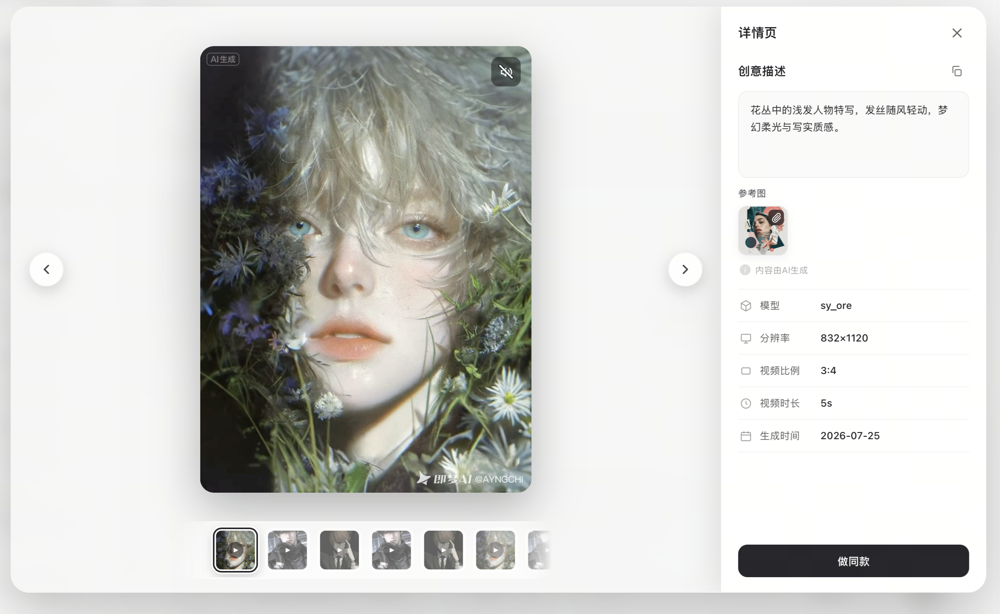

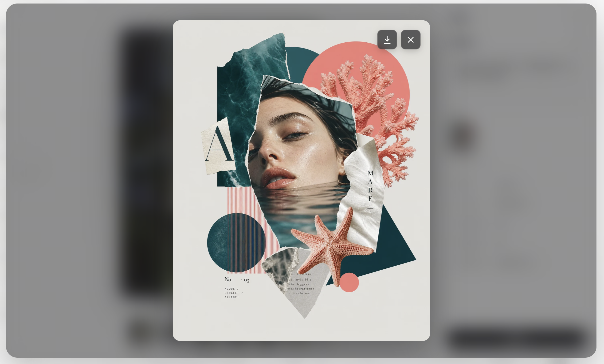

# 5\. “我的创作”模块修改需求

## 5\.1 模块结构与搜索

页面增加“我的创作”模块，效果如图 21 所示。该模块顶部展示“历史作品”，其下方显示说明文字“生成任务会直接出现在这里，完成后自动保存为作品”。

“我的创作”模块同样提供搜索框及“视频/图片”类型筛选按钮，按钮顺序、默认选中状态、单选切换和类型内搜索逻辑均与素材中心一致；搜索框内的文字表述改为“搜索我的创作”。“我的创作”内图片和视频作品的详情信息与素材中心同类型作品一致，并展示按 YYYY\-MM\-DD 格式呈现的生成时间。

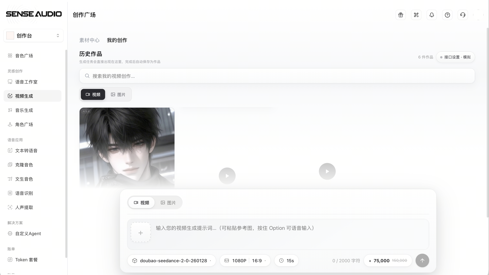

## 5\.2 生成任务展示

用户在创作输入框内发送图片或视频创作需求后，页面跳转至“我的创作”界面，并自动切换到与本次任务一致的类型筛选，使当前生成任务立即可见，效果如图 22 所示。图片生成任务的展示框下方仅显示本次使用的模型和比例，不显示具体尺寸；视频生成任务显示模型、分辨率、比例和时长。生成任务完成后，自动保存为作品。

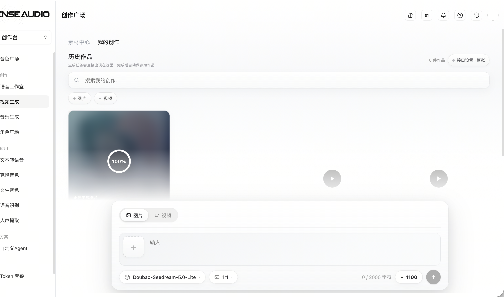

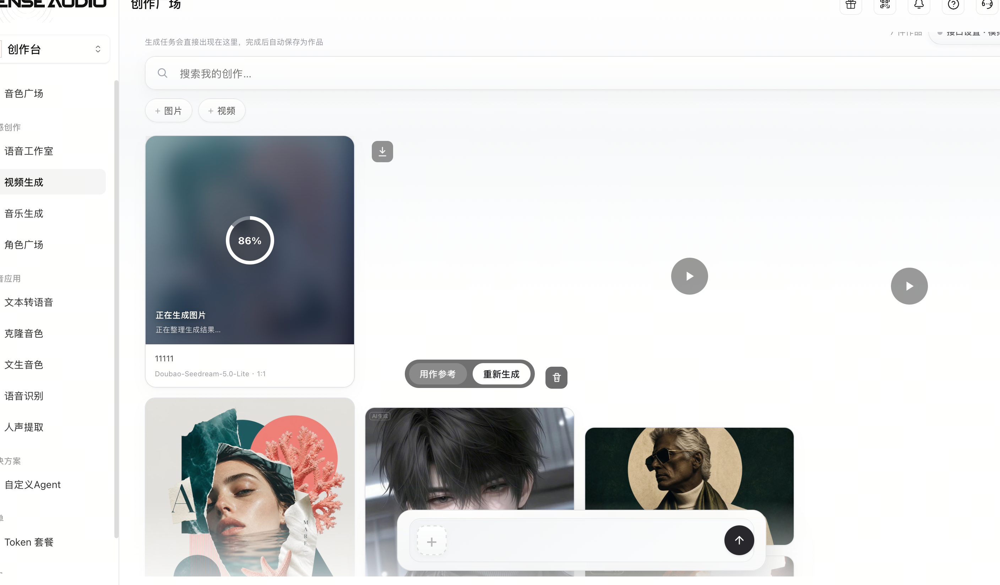

# 6\. 页面进入方式

不再设置任何首页开屏弹窗，用户首次或再次打开页面时，直接进入主页内容，无需点击“开始创作”或“同意并继续”。

# 7\. 图片展示缓冲底图

原版本图片缓冲时的底图颜色不好看，需要进行更换（更换样式以设计稿为准）

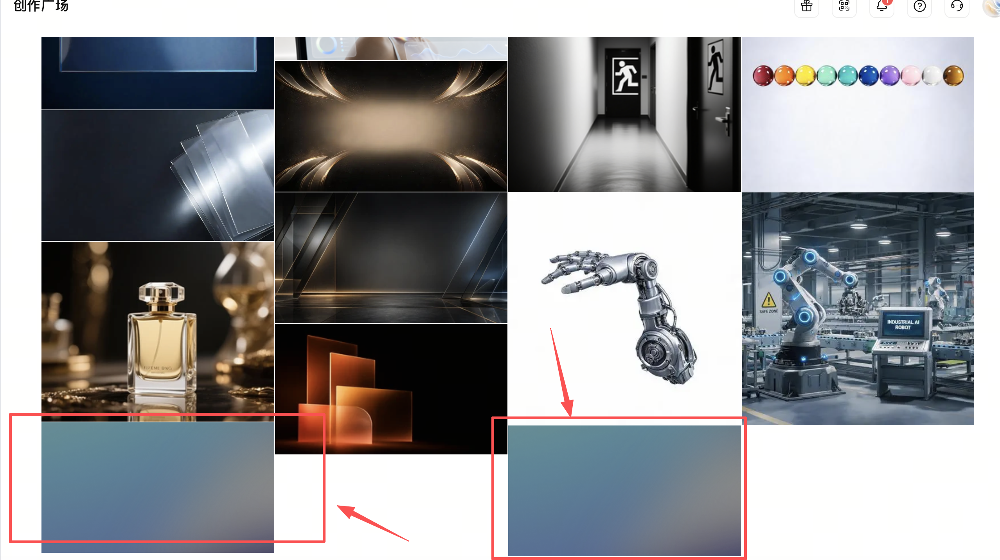

# 8\. demo演示按钮说明

如图24所示的接口设置按钮为demo演示功能按键，实际上线产品中没有该按钮，将“6件作品”处的文字右移即可

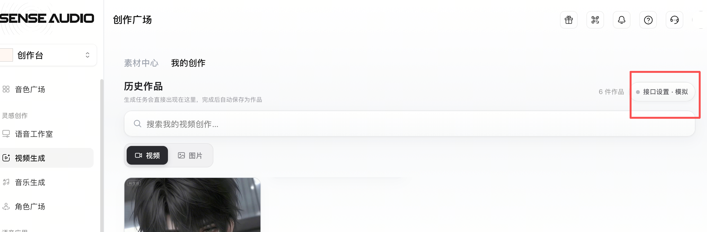

# 9\. 内部团队版本：作品发布与审核（暂不考虑开发）

前述第 1～5 章为面向普通用户的页面版本。本章说明面向内部团队成员账号开放的特殊能力，变化范围仅涉及“我的创作”页面，以及图片/视频生成完成后的作品详情页；其他页面功能不作额外调整。内部团队版本的“我的创作”页面整体效果如内部版图 1 所示。

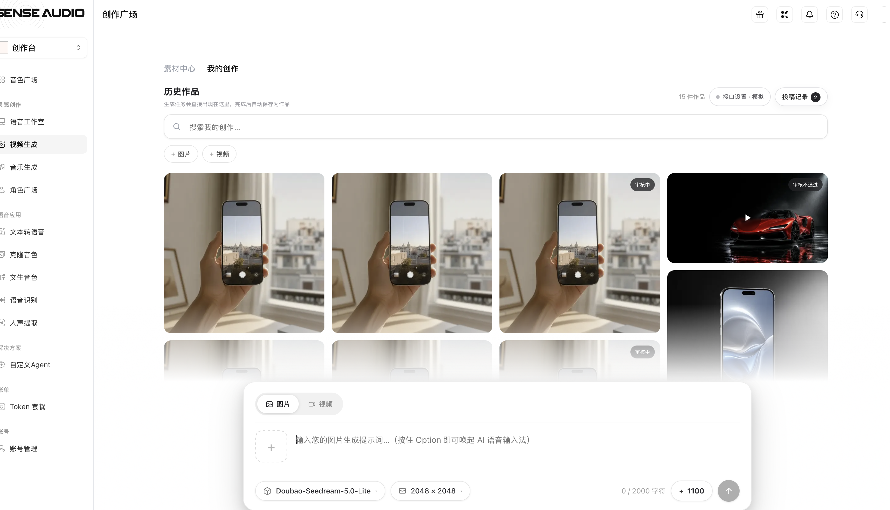

## 9\.1 作品详情页增加“发布上传”入口

内部团队成员生成图片或视频后，点击“我的创作”中的素材卡片进入作品详情页。图片作品详情页如内部版图 2 所示，视频作品详情页如内部版图 3 所示。与面向用户的版本相比，两类详情页均增加“发布上传”按钮。

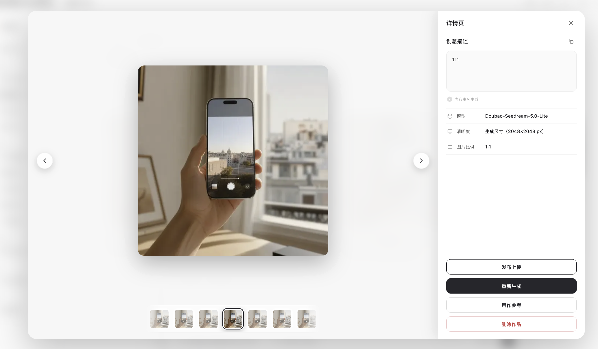

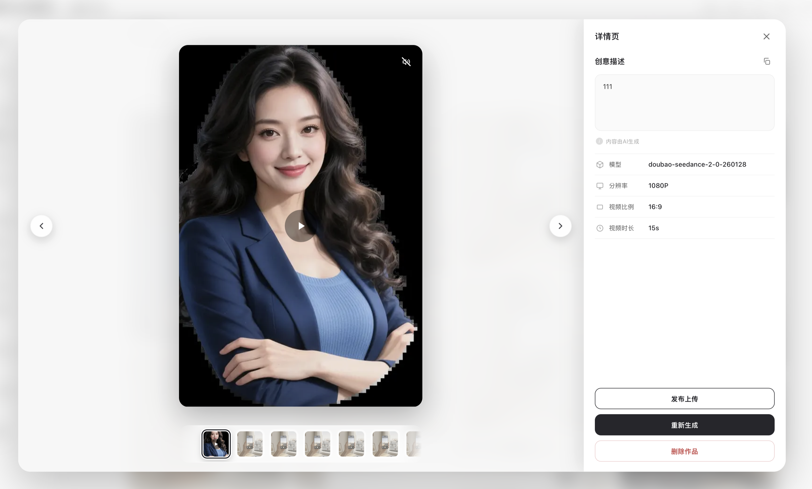

点击“发布上传”后，页面打开发布上传授权弹窗，效果如内部版图 4 所示。弹窗用于说明作品发布与使用授权内容，并提示作品需要先提交公司后台审核，通过后才可能进入素材中心。用户勾选同意授权内容并点击“同意授权并上传”后，当前作品上传至公司后台并进入审核流程。

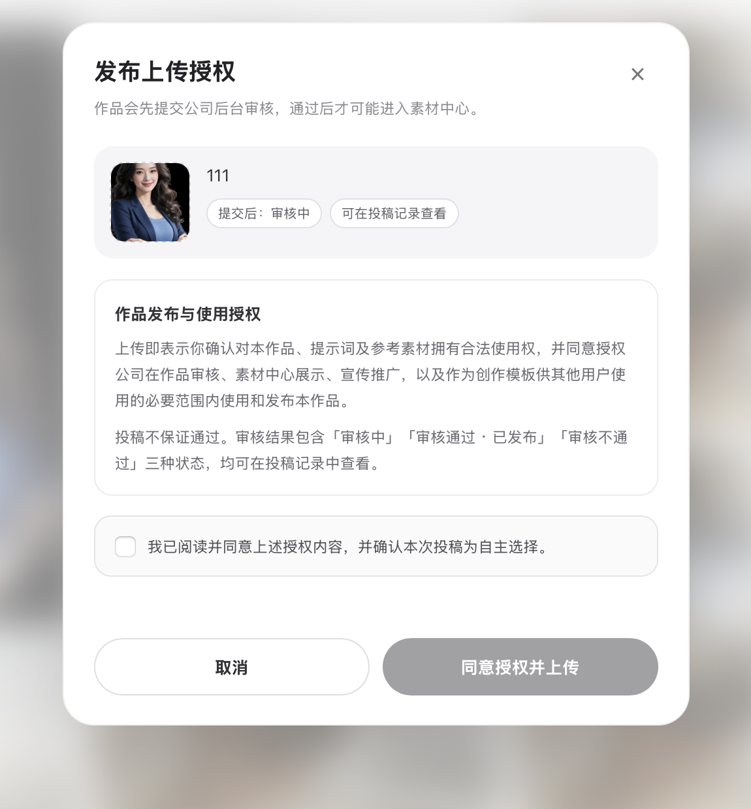

## 9\.2 审核与发布流程

1. 内部团队成员在作品详情页点击“发布上传”，阅读并同意授权内容后提交作品。

2. 作品上传至公司后台，进入审核流程。

3. 公司审核通过后，作品发布至素材中心，并显示在素材中心的素材卡片列表中。

4. 审核结果同步回“我的创作”页面及作品详情页，内部团队成员可以查看当前审核与发布状态。

## 9\.3 “我的创作”卡片审核状态

已经提交发布的图片或视频作品，在“我的创作”页面的素材卡片右上角显示审核状态标签。状态共分为三种：

- “审核中”，效果如内部版图 5 所示。

- “审核通过 · 已发布”，效果如内部版图 6 所示。

- “审核不通过”，效果如内部版图 7 所示。

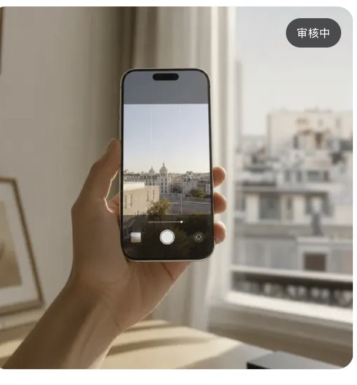

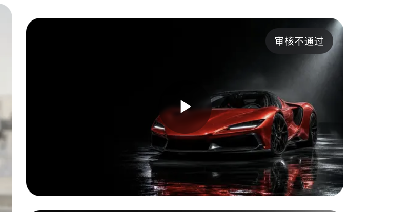

点击带有审核状态的素材卡片后，作品详情页同步展示对应状态。审核中、审核通过并已发布、审核不通过三种详情页状态分别如内部版图 8、内部版图 9、内部版图 10 所示。

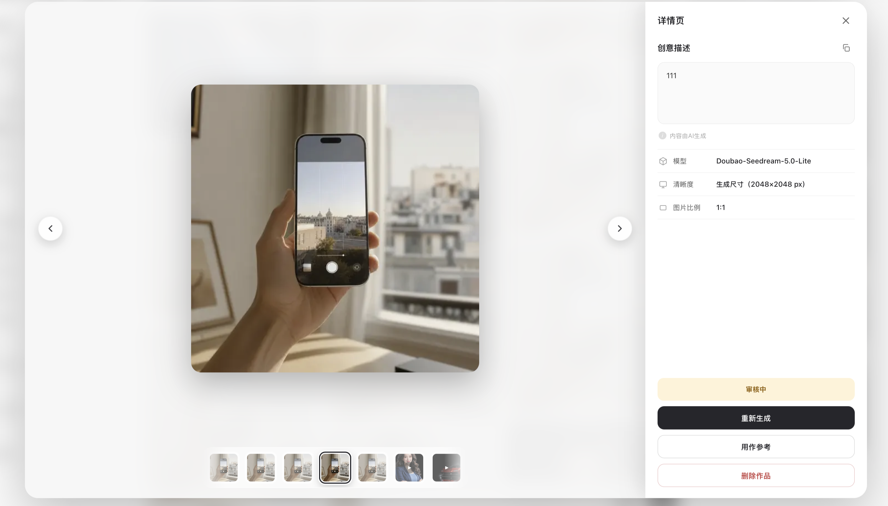

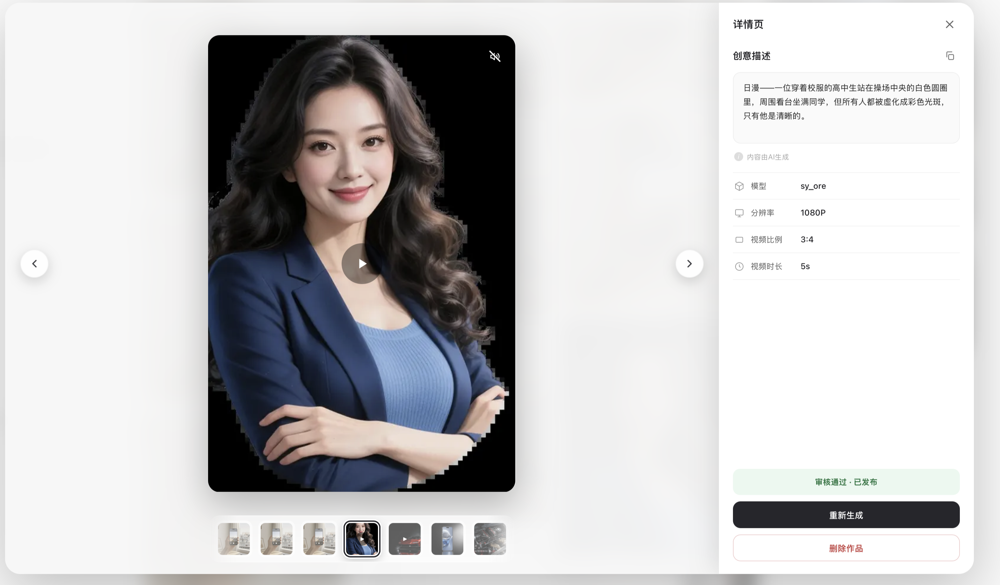

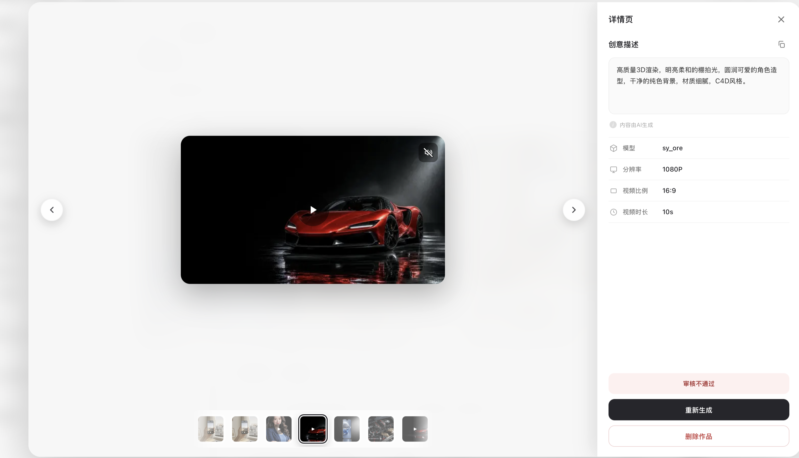

## 9\.4 投稿记录

“我的创作”页面右上角增加“投稿记录”入口，位置如内部版图 11 所示。点击后打开投稿记录弹窗，效果如内部版图 12 所示。

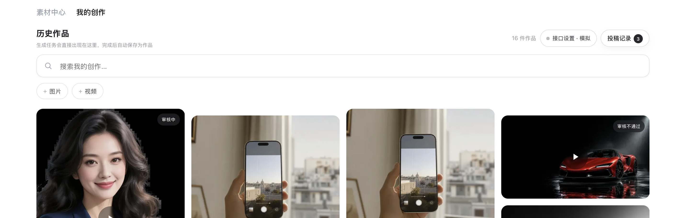

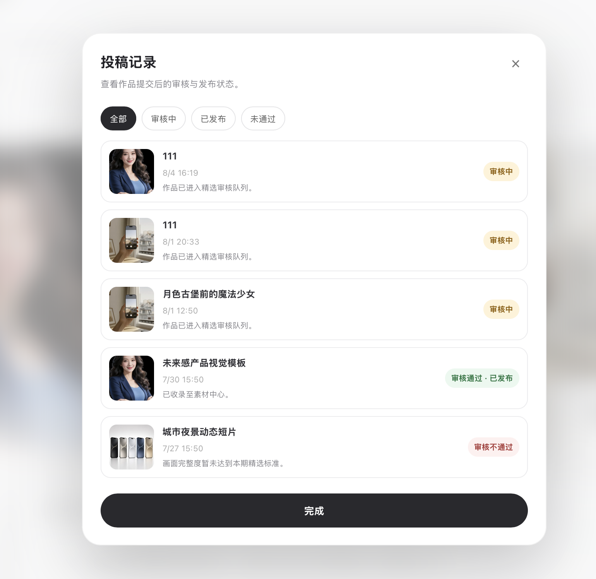

投稿记录用于集中查看作品提交后的审核与发布状态。弹窗支持按“全部”“审核中”“已发布”“未通过”进行筛选；每条记录展示作品缩略图、作品名称、提交时间及当前状态。

## 9\.5 开放范围与后续价值

当前“发布上传”、审核状态及投稿记录功能仅对团队内部成员账号开放。该能力可以让内部团队成员在生成效果较好的图片或视频后，直接提交至公司素材库审核；审核通过后进入素材中心，减少素材整理与上传流程。

该能力同时为后续面向普通用户开放素材广场预留功能入口。例如，未来用户可以分享、发布自己的生成作品及提示词素材到素材广场；作品审核通过后，可进一步结合积分奖励等机制。此部分为后续扩展方向，不属于当前内部版本的实际功能范围。
