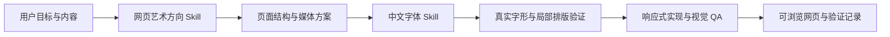

# Web Design Skill 体系 | Web Design Skill System

[English Version](#english-version)

> 将 300+ 网页前端设计 Prompt 中反复出现的有效方法，按照 Skill Tree 蒸馏为网页艺术指导、中文字体设计和视觉质量验证工作流。

## 公开结构

```text
web-design/
├── web-design-skill/                 整体视觉方向与网页生产 Skill（公开概况版）
├── chinese-typography-web-design/    中文字体与排版 Skill（公开概况版）
└── web-design-skill-showcase/        公开生成案例与 QA 证据
```

| 组件 | 负责范围 | 当前公开内容 |
| --- | --- | --- |
| [web-design-skill](./web-design-skill/) | 需求提炼、艺术方向、布局、媒体、动效、响应式与视觉验收 | 能力说明、输入输出和高层结构 |
| [chinese-typography-web-design](./chinese-typography-web-design/) | 中文字体选择、层级、混排、授权与真实页面验证 | 能力说明、协作边界和高层结构 |
| [web-design-skill-showcase](./web-design-skill-showcase/) | 验证两项 Skill 在不同主题中的组合效果 | 可查看的网页、资源、截图与 QA 记录 |

## 工作方式



两个核心 Skill 目前仍在持续研究和迭代。公开仓库保留产品化思路、基本结构与实际生成证据，完整执行协议、参考库、模板和验证脚本不公开。

[返回 Skills 目录](../README.md)

---

## English Version

> A Skill Tree distilled from recurring, effective methods found across 300+ front-end design prompts, covering web art direction, Chinese typography, and visual-quality verification.

### Public Structure

```text
web-design/
├── web-design-skill/                 Web art direction and production Skill (public overview)
├── chinese-typography-web-design/    Chinese typography Skill (public overview)
└── web-design-skill-showcase/        Public examples and QA evidence
```

| Component | Responsibility | Public material |
| --- | --- | --- |
| [web-design-skill](./web-design-skill/) | Brief synthesis, art direction, layout, media, motion, responsive design, and visual review | Capability summary, inputs/outputs, and high-level architecture |
| [chinese-typography-web-design](./chinese-typography-web-design/) | Chinese type selection, hierarchy, mixed-script composition, licensing, and in-page validation | Capability summary, collaboration boundary, and high-level architecture |
| [web-design-skill-showcase](./web-design-skill-showcase/) | Demonstrates the combined results across different subjects | Viewable pages, assets, screenshots, and QA records |

The two core Skills remain under active research and iteration. The public repository retains the productized approach, basic architecture, and generated evidence; complete execution protocols, reference libraries, templates, and validators remain private.

[Back to Skills](../README.md)
