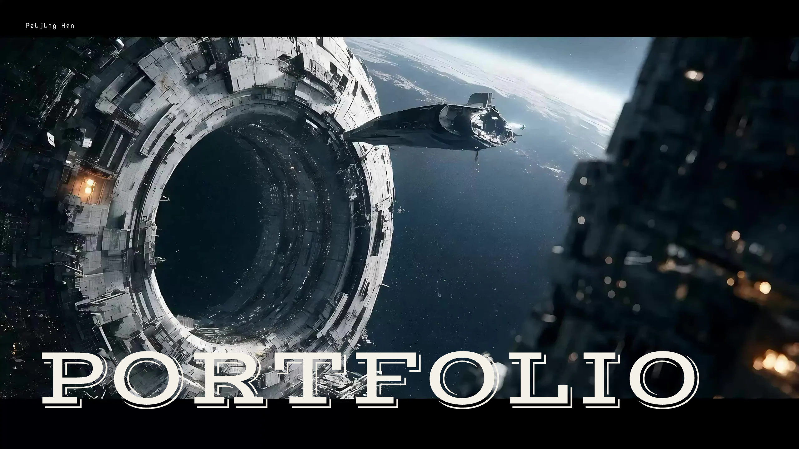

# 个人vibecoding项目 | Personal vibecoding Projects

[English Version](#english-version)

本目录收录我独立完成的vibecoding项目，包括产品概念原型、个人网站设计、桌面交互应用和自由想法的落地实现。项目中会根据需要独立完成前端设计、交互逻辑、桌面端能力、后端接口或工作流设计。

## 项目一览

| 项目 | 项目内容 | 主要材料 | 状态说明 |
| --- | --- | --- | --- |
| [Career Studio](./vibecoding_careerstudio_demo/) | 面向求职场景的产品概念原型，包含简历与 JD 匹配、面试记录和面试准备等流程 | [项目流程文档](./vibecoding_careerstudio_demo/Project%20Workflow%20Document.pdf) · [HTML 原型](./vibecoding_careerstudio_demo/career-studio-preview.html) | 前端原型可查看；AI 生成结果为模拟内容，不包含生产后端；完整案例说明仍在整理 |
| [滚动叙事个人作品集网站](./personal-portfolio-website/) | 独立通过vibecoding完成的网站设计作品，以滚动驱动 600 帧连续画面，构成两页电影式个人作品集叙事 | [项目说明](./personal-portfolio-website/README.md) · [HTML 入口](./personal-portfolio-website/index.html) · [页面预览](./personal-portfolio-website/tests/artifacts/page-1.png) | 可本地运行；包含响应式交互、状态机、测试和发布优化后的网页帧序列 |
| [Hi, Claude! 电脑桌宠](./hi-claude-desktop-pet/) | 基于 Claude 形象制作的 macOS 桌宠，12 套角色具有不同待机和局部动画，可在屏幕或应用窗口边缘行走 | [项目说明](./hi-claude-desktop-pet/README.md) · [控制面板预览](./hi-claude-desktop-pet/docs/preview/settings-panel.png) · [Electron 源码](./hi-claude-desktop-pet/main.js) | 可从源码运行和重新打包；包含鼠标互动、窗口检测、三语言控制面板和本地设置 |

## 滚动叙事个人作品集网站



这是一个独立完成的网页视觉与交互实验。页面不是通过普通长页面堆叠内容，而是把滚动输入映射到连续画面，让访问者通过滚轮、触控或键盘推进和反向查看叙事。

| 设计 / 实现维度 | 内容 |
| --- | --- |
| 叙事方式 | 两页全屏结构，以 600 帧连续画面组织电影式滚动叙事 |
| 交互输入 | 支持鼠标滚轮、触控滑动、方向键、Page Up / Page Down 和空格键 |
| 技术实现 | 原生 HTML、CSS、JavaScript、Canvas 帧绘制和可独立测试的状态机 |
| 响应式处理 | 根据视口和设备像素比重绘 Canvas，并适配桌面端与移动端 |
| 资源优化 | 将原始 8K JPEG 帧转换为 2560×1440 WebP，600 帧由约 642 MB 降至约 75 MB |
| 质量验证 | 包含状态机边界测试、浏览器交互测试、字体与 Canvas 检查及页面截图 |

## Hi, Claude! 电脑桌宠

<p align="center"></p>

这是一个 macOS 桌面交互应用。12 套 Claude 风格角色不仅会沿屏幕边缘巡逻，也可以吸附到普通应用窗口的外沿行走；鼠标靠近、单击、拖动和右键分别触发跟随、跳跃粒子、重新放置和设置面板。

| 设计 / 实现维度 | 内容 |
| --- | --- |
| 角色与动画 | 12 套形象，每套具有独立的局部动画、步态、待机呼吸和眨眼表现 |
| 空间交互 | 屏幕四边巡逻、窗口阻拦、拖拽吸附到任意窗口外沿及方向自动镜像 |
| 控制能力 | 可调整速度、运动方式、桌宠数量、形象切换周期、巡逻位置和交互开关 |
| 技术实现 | Electron、透明置顶窗口、Canvas 动画、进程隔离 IPC 和 CoreGraphics 窗口枚举工具 |
| 本地与隐私 | 设置仅保存在本机；运行时不调用外部 API、不上传数据、不依赖在线素材 |

项目结构：

```text
vibecoding/
├── vibecoding_careerstudio_demo/    Career Studio 求职产品原型
├── personal-portfolio-website/      滚动叙事个人作品集网站
└── hi-claude-desktop-pet/           Hi, Claude! macOS 电脑桌宠
```

## 后续补充计划

Career Studio 的完整项目背景、个人决策、演示素材和复盘仍会继续整理；未来新增的独立项目也会按照“背景与目标 → 用户问题 → 个人职责与取舍 → Demo → 实现方式 → 验证与复盘”的结构补充。

[返回作品集首页](../README.md)

---

## English Version

This directory contains vibecoding projects that I completed independently, including product-concept prototypes, personal website design, desktop interaction apps, and working implementations of independent ideas. Depending on the project, I handle front-end design, interaction logic, desktop capabilities, backend API integration, or workflow design independently.

### Project Overview

| Project | What it is | Main artifacts | Status |
| --- | --- | --- | --- |
| [Career Studio](./vibecoding_careerstudio_demo/) | A product-concept prototype for job-search workflows, including resume–JD matching, interview logging, and interview preparation | [Project workflow document](./vibecoding_careerstudio_demo/Project%20Workflow%20Document.pdf) · [HTML prototype](./vibecoding_careerstudio_demo/career-studio-preview.html) | The front-end prototype is available; AI-generated results are mocked and no production backend is included. Full case-study documentation is still in progress |
| [Scroll-Driven Personal Portfolio Website](./personal-portfolio-website/) | A website-design project built independently through vibecoding, using scrolling to drive 600 consecutive frames across a cinematic two-page portfolio narrative | [Project README](./personal-portfolio-website/README.md) · [HTML entry point](./personal-portfolio-website/index.html) · [Page preview](./personal-portfolio-website/tests/artifacts/page-1.png) | Runs locally and includes responsive interaction, a state machine, tests, and a web-optimized frame sequence |
| [Hi, Claude! Desktop Pet](./hi-claude-desktop-pet/) | A Claude-inspired macOS desktop pet with 12 character forms, distinct idle / regional animations, and screen- or window-edge movement | [Project README](./hi-claude-desktop-pet/README.md) · [Control-panel preview](./hi-claude-desktop-pet/docs/preview/settings-panel.png) · [Electron source](./hi-claude-desktop-pet/main.js) | Runs and packages from source; includes mouse interaction, window detection, a three-language control panel, and local settings |

### Scroll-Driven Personal Portfolio Website


This is an independently completed visual and interaction experiment for the web. Instead of arranging content as a conventional long page, it maps user input to a continuous image sequence so visitors can move the story forward or backward with a mouse wheel, touch gesture, or keyboard.

| Design / implementation area | Details |
| --- | --- |
| Narrative approach | A two-page, full-screen structure organized as a cinematic 600-frame scroll story |
| Input methods | Mouse wheel, touch gestures, arrow keys, Page Up / Page Down, and the space bar |
| Technical implementation | Native HTML, CSS, JavaScript, Canvas frame rendering, and an independently testable state machine |
| Responsive behavior | Redraws the Canvas for the viewport and device pixel ratio and adapts across desktop and mobile layouts |
| Asset optimization | Converts the original 8K JPEG frames to 2560×1440 WebP, reducing the 600-frame sequence from approximately 642 MB to approximately 75 MB |
| Quality verification | Includes state-machine boundary tests, browser interaction tests, font and Canvas checks, and page screenshots |

### Hi, Claude! Desktop Pet

<p align="center"></p>

This is a macOS desktop interaction app. Twelve Claude-inspired characters patrol the screen perimeter or attach to the outer rim of an ordinary application window. Cursor proximity, clicking, dragging, and right-clicking trigger following, jump particles, repositioning, and the settings panel respectively.

| Design / implementation area | Details |
| --- | --- |
| Characters and animation | Twelve forms with distinct regional animation, walking gait, idle breathing, and blinking |
| Spatial interaction | Four-edge screen patrol, window blocking, drag-to-attach window walking, and automatic directional mirroring |
| Controls | Speed, movement style, pet count, form-change timing, patrol location, and interaction toggles |
| Technical implementation | Electron, transparent always-on-top windows, Canvas animation, context-isolated IPC, and a CoreGraphics window-enumeration helper |
| Local behavior and privacy | Settings remain on-device; the runtime makes no external API calls, uploads no data, and needs no online assets |

Directory structure:

```text
vibecoding/
├── vibecoding_careerstudio_demo/    Career Studio job-search product prototype
├── personal-portfolio-website/      Scroll-driven personal portfolio website
└── hi-claude-desktop-pet/           Hi, Claude! macOS desktop pet
```

### Planned Additions

The full Career Studio context, personal decisions, demo materials, and retrospective will continue to be organized. Future independent projects will follow a consistent structure: context and objective → user problem → personal role and trade-offs → demo → implementation approach → validation and retrospective.

[Back to portfolio home](../README.md)
