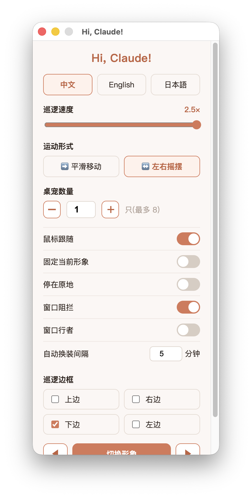
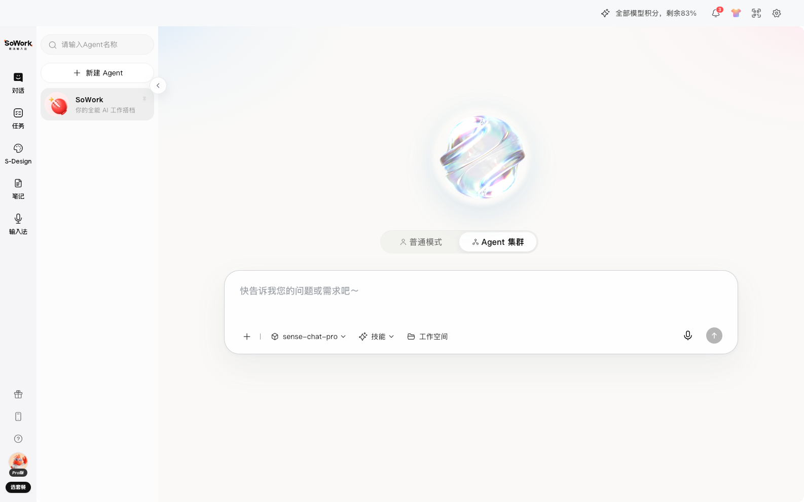

# 个人vibecoding项目 | Personal vibecoding Projects

[English Version](#english-version)

本目录收录我独立完成的vibecoding项目，包括产品概念原型、AI个人创作平台、个人网站设计、桌面交互应用和自由想法的落地实现。项目中会根据需要独立完成产品设计、前端设计、交互逻辑、桌面端能力、后端接口或工作流设计。

## 项目一览

| 项目 | 项目内容 | 主要材料 | 状态说明 |
| --- | --- | --- | --- |
| [幕间（Interlude）AI 角色创作平台](./mujian-creative-writing-platform/) | 源于个人写作兴趣的创作平台，让作者创建角色 Agent、组织多角色对话，并以可控的 Memory 与 Skill 让人物在正文之外继续生活 | [项目说明](./mujian-creative-writing-platform/README.md) · [完整 PRD](./mujian-creative-writing-platform/PRD.md) · [视觉预览](./mujian-creative-writing-platform/public/og.png) | 可本地运行；当前为交互原型，模型回复与 AI 分析为预设内容，交互数据保存在浏览器本地 |
| [滚动叙事个人作品集网站](./personal-portfolio-website-design/) | 独立通过vibecoding完成的网站设计作品，以滚动驱动 600 帧连续画面，构成两页电影式个人作品集叙事 | [项目说明](./personal-portfolio-website-design/README.md) · [HTML 入口](./personal-portfolio-website-design/index.html) · [页面预览](./personal-portfolio-website-design/tests/artifacts/page-1.png) | 可本地运行；包含响应式交互、状态机、测试和发布优化后的网页帧序列 |
| [Hi, Claude! 电脑桌宠](./hi-claude-desktop-pet/) | 基于 Claude 形象制作的 macOS 桌宠，12 套角色具有不同待机和局部动画，可在屏幕或应用窗口边缘行走 | [项目说明](./hi-claude-desktop-pet/README.md) · [控制面板预览](./hi-claude-desktop-pet/docs/preview/settings-panel.png) · [Electron 源码](./hi-claude-desktop-pet/main.js) | 可从源码运行和重新打包；包含鼠标互动、窗口检测、三语言控制面板和本地设置 |
| [语音优先桌面工作 Agent](./voice-first-desktop-work-agent/) | 以语音输入为亮点、以个人工作管理为核心服务的客户端 Agent 产品方案 | [项目说明](./voice-first-desktop-work-agent/README.md) · [完整产品工作流](./voice-first-desktop-work-agent/docs/product-workflow.md) · [原型截图](./voice-first-desktop-work-agent/assets/voice-first-agent-home.png) | 公开作品集安全版：展示产品设计、工作流和筛选后的高保真截图，不公开原客户端资源或可执行实现 |

## 幕间（Interlude）AI 角色创作平台


这个项目源于我对写作的长期兴趣：我希望笔下的人物不只存在于正文，而能在作者可控的世界观、记忆和行为规则下继续生活。为此，我把角色 Agent、多角色群聊、记忆治理和 Skill 编辑组织成一个面向小说创作者的“角色剧场”。

| 产品 / 实现维度 | 内容 |
| --- | --- |
| 核心闭环 | 多角色对话 → 候选记忆提取 → 作者编辑认知视角 → 确认为正典 → Skill 调整与角色试演 |
| 角色一致性 | 将客观事件与角色认知分离，让秘密、误解和信息差可以被表达，同时避免角色读取越权信息 |
| 作者控制权 | AI 只能提出候选内容，不能直接写入正典；Memory、Skill 与 Prompt 均按可解释、可编辑的产品思路设计 |
| 体验设计 | 作品书架、对话现场、导演台、故事星图、记忆台账、正文阅读和场景预演组成完整创作工作台 |
| 技术实现 | Next.js、React、TypeScript、Vinext/Vite、响应式界面与 `localStorage` 本地状态持久化 |
| 当前边界 | 不连接真实大模型、语音 API 或生产数据库；预设内容用于验证产品流程与交互体验 |

## 滚动叙事个人作品集网站


这是一个独立完成的网页视觉与交互实验。页面不是通过普通长页面堆叠内容，而是把滚动输入映射到连续画面，让访问者通过滚轮、触控或键盘推进和反向查看叙事。

| 设计 / 实现维度 | 内容 |
| --- | --- |
| 叙事方式 | 两页全屏结构，以 600 帧连续画面组织电影式滚动叙事 |
| 交互输入 | 支持鼠标滚轮、触控滑动、方向键、Page Up / Page Down 和空格键 |
| 技术实现 | 原生 HTML、CSS、JavaScript、Canvas 帧绘制和可独立测试的状态机 |
| 响应式处理 | 根据视口和设备像素比重绘 Canvas，并适配桌面端与移动端 |
| 资源优化 | 将原始 8K JPEG 帧转换为 2560×1440 WebP，600 帧由约 642 MB 降至约 75 MB |
| 质量验证 | 包含状态机边界测试、浏览器交互测试、字体与 Canvas 检查及页面截图 |

## Hi, Claude! 电脑桌宠

<p align="center"></p>

这是一个 macOS 桌面交互应用。12 套 Claude 风格角色不仅会沿屏幕边缘巡逻，也可以吸附到普通应用窗口的外沿行走；鼠标靠近、单击、拖动和右键分别触发跟随、跳跃粒子、重新放置和设置面板。

| 设计 / 实现维度 | 内容 |
| --- | --- |
| 角色与动画 | 12 套形象，每套具有独立的局部动画、步态、待机呼吸和眨眼表现 |
| 空间交互 | 屏幕四边巡逻、窗口阻拦、拖拽吸附到任意窗口外沿及方向自动镜像 |
| 控制能力 | 可调整速度、运动方式、桌宠数量、形象切换周期、巡逻位置和交互开关 |
| 技术实现 | Electron、透明置顶窗口、Canvas 动画、进程隔离 IPC 和 CoreGraphics 窗口枚举工具 |
| 本地与隐私 | 设置仅保存在本机；运行时不调用外部 API、不上传数据、不依赖在线素材 |

## 语音优先桌面工作 Agent



这是一个以语音为高频入口的客户端 Agent 产品设计。它不把 AI 停留在一次对话，而是把用户输入继续转化为待处理事项、自动工作、个人成果、项目协作和可复用的资料，让工作从“提出需求”延伸到“执行、确认与沉淀”。

| 产品 / 实现维度 | 内容 |
| --- | --- |
| 产品定位 | 面向个人知识工作者的桌面 Agent 与工作管理中枢 |
| 核心链路 | 语音 / 文字输入 → Agent 选择与执行 → 我的工作 → 成果确认 → 项目与资料库 |
| 工作管理 | 待处理、自动工作和个人成果形成统一队列，支持周期执行与异常反馈 |
| 项目协作 | 项目内组织 AI 工作台、看板、成果、资料库和自动工作，并保持上下文隔离 |
| 人工确认 | AI 成果先由用户审阅，再决定是否提交项目或纳入资料库 |
| 个人产出 | 独立完成产品结构、信息架构、完整工作流、高保真原型和跨模块状态验证 |
| 公开边界 | 本仓库仅提供安全版说明与截图；可执行源码和原客户端资源不公开 |

项目结构：

```text
vibecoding/
├── mujian-creative-writing-platform/    幕间 AI 角色创作平台
├── personal-portfolio-website-design/   滚动叙事个人作品集网站
├── hi-claude-desktop-pet/               Hi, Claude! macOS 电脑桌宠
└── voice-first-desktop-work-agent/       语音优先桌面工作 Agent（公开作品集安全版）
```

## 后续补充计划

未来新增的独立项目会按照“背景与目标 → 用户问题 → 个人职责与取舍 → Demo → 实现方式 → 验证与复盘”的结构持续补充。

[返回作品集首页](../README.md)

---

## English Version

This directory contains vibecoding projects that I completed independently, including product-concept prototypes, an AI-powered personal creation platform, personal website design, desktop interaction apps, and working implementations of independent ideas. Depending on the project, I independently handle product design, front-end design, interaction logic, desktop capabilities, backend API integration, or workflow design.

### Project Overview

| Project | What it is | Main artifacts | Status |
| --- | --- | --- | --- |
| [Interlude AI Character-Creation Platform](./mujian-creative-writing-platform/) | A writing-inspired creative platform where authors create character Agents, stage multi-character conversations, and use governed Memory and Skills to let characters continue living beyond the manuscript | [Project README](./mujian-creative-writing-platform/README.md) · [Full PRD](./mujian-creative-writing-platform/PRD.md) · [Visual preview](./mujian-creative-writing-platform/public/og.png) | Runs locally; the current version is an interaction prototype with scripted model/AI outputs and browser-local state |
| [Scroll-Driven Personal Portfolio Website](./personal-portfolio-website-design/) | A website-design project built independently through vibecoding, using scrolling to drive 600 consecutive frames across a cinematic two-page portfolio narrative | [Project README](./personal-portfolio-website-design/README.md) · [HTML entry point](./personal-portfolio-website-design/index.html) · [Page preview](./personal-portfolio-website-design/tests/artifacts/page-1.png) | Runs locally and includes responsive interaction, a state machine, tests, and a web-optimized frame sequence |
| [Hi, Claude! Desktop Pet](./hi-claude-desktop-pet/) | A Claude-inspired macOS desktop pet with 12 character forms, distinct idle / regional animations, and screen- or window-edge movement | [Project README](./hi-claude-desktop-pet/README.md) · [Control-panel preview](./hi-claude-desktop-pet/docs/preview/settings-panel.png) · [Electron source](./hi-claude-desktop-pet/main.js) | Runs and packages from source; includes mouse interaction, window detection, a three-language control panel, and local settings |
| [Voice-First Desktop Work Agent](./voice-first-desktop-work-agent/) | A client-side Agent product concept with voice as the key input and personal work management as the primary service | [Project README](./voice-first-desktop-work-agent/README.md) · [Complete product workflow](./voice-first-desktop-work-agent/docs/product-workflow.md) · [Prototype preview](./voice-first-desktop-work-agent/assets/voice-first-agent-home.png) | Public-safe portfolio edition: product design, workflow, and selected high-fidelity screenshots are public; original client resources and executable implementation are excluded |

### Interlude AI Character-Creation Platform


This project grew out of my long-standing interest in writing. I wanted fictional characters to exist beyond a static manuscript, continuing to live inside an author-controlled system of world facts, memories, and behavioral rules. I therefore designed a “character theatre” for fiction creators that brings together character Agents, multi-character chat, memory governance, and Skill editing.

| Product / implementation area | Details |
| --- | --- |
| Core loop | Multi-character conversation → candidate-memory extraction → author-edited perspectives → canon confirmation → Skill refinement and character rehearsal |
| Character consistency | Separates objective events from character knowledge so secrets, misunderstandings, and information asymmetry remain possible without unauthorized knowledge leakage |
| Author control | AI can only propose candidate content, never write canon automatically; Memory, Skills, and Prompts are designed to remain explainable and editable |
| Experience design | A story library, conversation stage, director panel, story constellation, memory ledger, manuscript reader, and scene rehearsal form one creative workspace |
| Technical implementation | Next.js, React, TypeScript, Vinext/Vite, a responsive interface, and browser-local state persistence with `localStorage` |
| Current boundary | No live LLM, speech API, or production database; scripted content validates the product flow and interaction experience |

### Scroll-Driven Personal Portfolio Website


This is an independently completed visual and interaction experiment for the web. Instead of arranging content as a conventional long page, it maps user input to a continuous image sequence so visitors can move the story forward or backward with a mouse wheel, touch gesture, or keyboard.

| Design / implementation area | Details |
| --- | --- |
| Narrative approach | A two-page, full-screen structure organized as a cinematic 600-frame scroll story |
| Input methods | Mouse wheel, touch gestures, arrow keys, Page Up / Page Down, and the space bar |
| Technical implementation | Native HTML, CSS, JavaScript, Canvas frame rendering, and an independently testable state machine |
| Responsive behavior | Redraws the Canvas for the viewport and device pixel ratio and adapts across desktop and mobile layouts |
| Asset optimization | Converts the original 8K JPEG frames to 2560×1440 WebP, reducing the 600-frame sequence from approximately 642 MB to approximately 75 MB |
| Quality verification | Includes state-machine boundary tests, browser interaction tests, font and Canvas checks, and page screenshots |

### Hi, Claude! Desktop Pet

<p align="center"></p>

This is a macOS desktop interaction app. Twelve Claude-inspired characters patrol the screen perimeter or attach to the outer rim of an ordinary application window. Cursor proximity, clicking, dragging, and right-clicking trigger following, jump particles, repositioning, and the settings panel respectively.

| Design / implementation area | Details |
| --- | --- |
| Characters and animation | Twelve forms with distinct regional animation, walking gait, idle breathing, and blinking |
| Spatial interaction | Four-edge screen patrol, window blocking, drag-to-attach window walking, and automatic directional mirroring |
| Controls | Speed, movement style, pet count, form-change timing, patrol location, and interaction toggles |
| Technical implementation | Electron, transparent always-on-top windows, Canvas animation, context-isolated IPC, and a CoreGraphics window-enumeration helper |
| Local behavior and privacy | Settings remain on-device; the runtime makes no external API calls, uploads no data, and needs no online assets |

### Voice-First Desktop Work Agent


This client-side Agent concept uses voice as a high-frequency entry point. Instead of ending with a single conversation, it turns user requests into pending work, recurring automation, personal deliverables, project collaboration, and reusable knowledge, extending the experience from request to execution, review, and capture.

| Product / implementation area | Details |
| --- | --- |
| Positioning | A desktop Agent and work-management hub for individual knowledge workers |
| Core journey | Voice / text input → Agent selection and execution → My Work → human review → projects and knowledge base |
| Work management | Pending, automated, and personal-deliverable views form one queue with recurring execution and exception feedback |
| Project collaboration | Each project combines an AI workspace, board, deliverables, knowledge base, and automation with isolated context |
| Human control | AI outputs are reviewed before they can enter a project or become reusable knowledge |
| Personal contribution | Independently completed the product structure, information architecture, full workflow, high-fidelity prototype, and cross-module state validation |
| Public boundary | This repository contains documentation and screenshots only; executable source and original client resources remain private |

Directory structure:

```text
vibecoding/
├── mujian-creative-writing-platform/    Interlude AI character-creation platform
├── personal-portfolio-website-design/   Scroll-driven personal portfolio website
├── hi-claude-desktop-pet/               Hi, Claude! macOS desktop pet
└── voice-first-desktop-work-agent/       Voice-first desktop work Agent (public-safe edition)
```

### Planned Additions

Future independent projects will follow a consistent structure: context and objective → user problem → personal role and trade-offs → demo → implementation approach → validation and retrospective.

[Back to portfolio home](../README.md)
