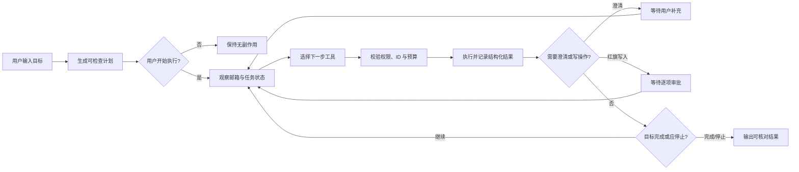
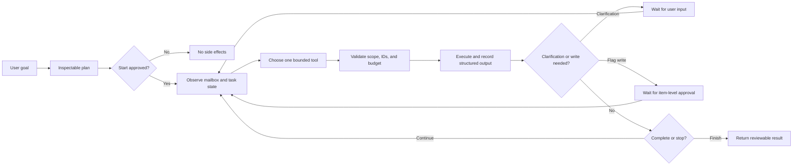

# 来信 | Laixin Email Agent

[English Version](#english-version)

> 一个由我独立设计与实现的个人邮箱 Agent：帮助正在投递实习、联系导师或维护重要往来的用户，从营销邮件中筛出值得关注的来信、跟踪指定投递是否收到回复，并把面试邮件整理成可核对的待办。

“来信”不是一个把模型直接接管邮箱的聊天机器人，而是一套本地运行、权限受限、过程可观察的 Agent 产品。它把邮箱读取、规则筛选、回复关联、待办提取和人工确认组织成完整工作流，并通过 Harness 对工具、上下文、预算和写操作进行约束。

## 项目亮点

| 维度 | 设计与实现 |
| --- | --- |
| 重点来信 | 支持自定义发件地址与主题关键词；同一邮件可展示多个命中原因 |
| 回复追踪 | 从已发送邮件选择投递，优先依据 `Message-ID`、`In-Reply-To` 与 `References` 建立可靠关联 |
| 面试待办 | 从用户指定的一封邮件提取公司、岗位、时间、链接与原文证据，先生成草稿，再由用户编辑确认 |
| 定时简报 | 北京时间早、午、晚三个时段运行；结果保存在本地简报中心并支持桌面通知 |
| 真实邮箱能力 | 通过 TLS / IMAP 连接网易个人邮箱；读取范围有界，支持经确认的 `\Flagged` 红旗写回 |
| 可选模型能力 | 默认可走本地规则；只有用户明确选择时，才把指定邮件的必要内容交给 DeepSeek 辅助提取 |
| Agent Harness | 包含目标预览、执行循环、受限工具集、预算、澄清、降级、取消、审批门禁和可观察事件轨迹 |

## Agent 如何运行



循环遵循“观察 → 规划 → 校验 → 调用工具 → 记录 → 继续或停止”。模型只能返回受约束的 JSON 动作，不能执行任意代码；邮件正文始终作为不可信数据，不能改变 Agent 权限。

## 权限与隐私边界

- 服务仅监听 `127.0.0.1`，不应直接暴露到公网。
- 邮箱客户端授权码与 DeepSeek API Key 只保留在后端进程内存中，重启后需要重新输入。
- `.data/` 中的本地状态可能包含个人邮件元数据，已被 `.gitignore` 排除，公开仓库不包含任何真实运行数据。
- 同步最多读取最近 30 天的 300 封邮件；正文仅在用户指定后按需读取，附件不会自动下载。
- Agent 没有发送、回复、转发、删除、移动邮件或自动打开链接的工具。
- 红旗写入需要明确目标与用户批准，写入后还会回读验证；待办始终先生成草稿。

## 技术结构

```text
laixin-email-agent/
├── src/                         React 前端：收件箱、追踪、待办、简报与 Agent 轨迹
├── server/                      本地 API、IMAP 适配器、领域规则、调度与 Agent Loop
├── scripts/                     HTTP Smoke 与 Agent Loop 验证脚本
├── docs/
│   └── product-and-harness-design.md
├── AGENT_LOOP_CONTRACT.md       执行循环、工具和预算契约
├── API_CONTRACT.md              前后端接口与权限约定
├── launch-laixin-agent.command  macOS 双击启动脚本
└── package.json
```

主要技术：React、TypeScript、Vite、Express、ImapFlow、MailParser、Node.js Test Runner。

## 本地运行

需要 Node.js 22 或更高版本。

```bash
git clone https://github.com/Peggy-H33/Portfolio.git
cd Portfolio/vibecoding/laixin-email-agent
npm ci
npm run build
npm start
```

浏览器访问 `http://127.0.0.1:8787/`。macOS 也可以双击 `launch-laixin-agent.command`。

未连接真实邮箱时，应用使用虚构演示数据。连接真实网易邮箱需要用户本人在邮箱设置中开启 IMAP 并生成客户端授权码；请勿使用网页邮箱主密码。

## 验证

```bash
npm test
npm run test:agent-loop
npm run test:smoke
npm run build
```

自动化测试覆盖规则分类、受限查询、稳定邮件身份、Agent 计划无副作用、澄清与取消、模型失败降级、红旗审批门禁、待办草稿，以及 HTTP 接口的跨站写入拒绝与状态持久化。真实账号的认证、读取和红旗写回仍需由使用者在自己的邮箱环境中完成最终验证。

## 设计材料

- [产品与 Harness 设计](./docs/product-and-harness-design.md)
- [Agent Loop 契约](./AGENT_LOOP_CONTRACT.md)
- [本地 API 契约](./API_CONTRACT.md)

本项目为个人独立作品，与网易或 DeepSeek 无隶属或官方合作关系；相关名称仅用于说明兼容的邮箱服务与可选模型接口。

[返回 vibecoding 项目目录](../README.md) · [返回作品集首页](../../README.md)

---

## English Version

> An independently designed and implemented personal email Agent for internship applicants, students contacting potential supervisors, and users managing important correspondence. It separates noteworthy messages from promotional noise, tracks replies to selected outreach, and turns interview emails into verifiable to-dos.

Laixin is not a chatbot with unrestricted mailbox access. It is a local-first, bounded, and observable Agent product that connects mail retrieval, rule-based triage, reply correlation, task extraction, and human confirmation. A custom Harness constrains tools, context, budgets, and write operations throughout the workflow.

### Highlights

| Area | Design and implementation |
| --- | --- |
| Priority inbox | User-defined sender addresses and subject keywords, with every matching reason shown |
| Reply tracking | Tracks a selected sent message using `Message-ID`, `In-Reply-To`, and `References` rather than subject similarity alone |
| Interview to-dos | Extracts company, role, time, link, and source evidence from one user-selected email; output remains an editable draft until confirmed |
| Scheduled briefs | Runs in three configurable Beijing-time windows and stores results in a local brief center with optional desktop notifications |
| Live mailbox support | Connects to NetEase personal mail through TLS / IMAP, performs bounded reads, and supports confirmed `\Flagged` updates |
| Optional model path | Works with local rules by default; DeepSeek receives only the necessary content of an explicitly selected email when the user opts in |
| Agent Harness | Includes plan preview, an execution loop, capability-scoped tools, budgets, clarification, fallback, cancellation, approval gates, and observable events |

### Execution Model



The loop follows observe → plan → validate → invoke → record → continue or stop. A model may return only constrained JSON actions, never arbitrary code. Email content is always treated as untrusted data and cannot expand the Agent's permissions.

### Permission and Privacy Boundaries

- The service binds only to `127.0.0.1` and should not be exposed directly to the public internet.
- The mailbox authorization code and optional DeepSeek API key remain in backend process memory and must be re-entered after restart.
- Local `.data/` state may contain personal mail metadata; it is ignored by Git and no live mailbox data is included in this public repository.
- Synchronization is capped at 300 messages from the latest 30 days. Bodies are fetched only for a user-selected message, and attachments are never downloaded automatically.
- The Agent has no tools for sending, replying, forwarding, deleting, moving messages, or opening links automatically.
- Flag writes require a specific target and explicit approval, followed by read-back verification. To-dos always begin as drafts.

### Technical Structure

```text
laixin-email-agent/
├── src/                         React UI for inbox, tracking, to-dos, briefs, and Agent traces
├── server/                      Local API, IMAP adapter, domain rules, scheduler, and Agent Loop
├── scripts/                     HTTP smoke and Agent Loop verification
├── docs/
│   └── product-and-harness-design.md
├── AGENT_LOOP_CONTRACT.md       Execution-loop, tool, and budget contract
├── API_CONTRACT.md              Frontend/backend API and permission contract
├── launch-laixin-agent.command  Double-click macOS launcher
└── package.json
```

Core stack: React, TypeScript, Vite, Express, ImapFlow, MailParser, and the Node.js test runner.

### Run Locally

Node.js 22 or later is required.

```bash
git clone https://github.com/Peggy-H33/Portfolio.git
cd Portfolio/vibecoding/laixin-email-agent
npm ci
npm run build
npm start
```

Open `http://127.0.0.1:8787/`. On macOS, you can also double-click `launch-laixin-agent.command`.

The application uses fictional demo data until a live mailbox is connected. A user must personally enable IMAP in their NetEase mailbox and generate a client authorization code; the primary webmail password should not be used.

### Verification

```bash
npm test
npm run test:agent-loop
npm run test:smoke
npm run build
```

Automated coverage includes rule classification, fail-closed queries, stable message identity, side-effect-free planning, clarification and cancellation, model fallback, approval-gated flagging, to-do drafts, cross-site write rejection, and state persistence. Live authentication, mailbox reads, and flag round trips still require final verification in the user's own mailbox environment.

### Design Artifacts

- [Product and Harness design](./docs/product-and-harness-design.md)
- [Agent Loop contract](./AGENT_LOOP_CONTRACT.md)
- [Local API contract](./API_CONTRACT.md)

This is an independent personal project and is not affiliated with or endorsed by NetEase or DeepSeek. Product names are used only to identify compatible services and optional integrations.

[Back to vibecoding projects](../README.md) · [Back to portfolio home](../../README.md)
