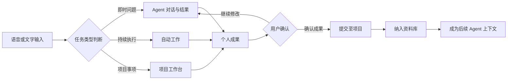
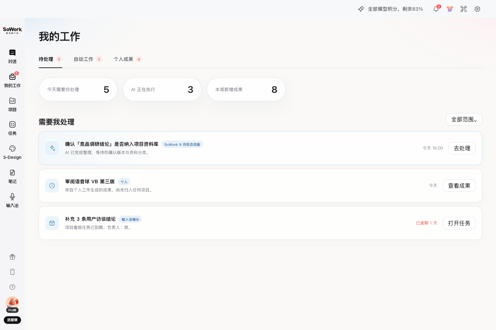
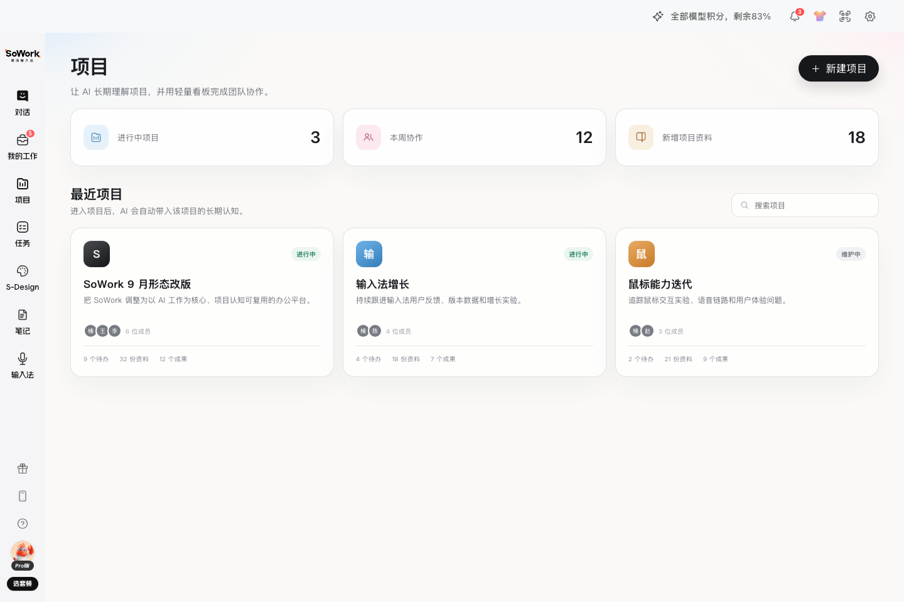
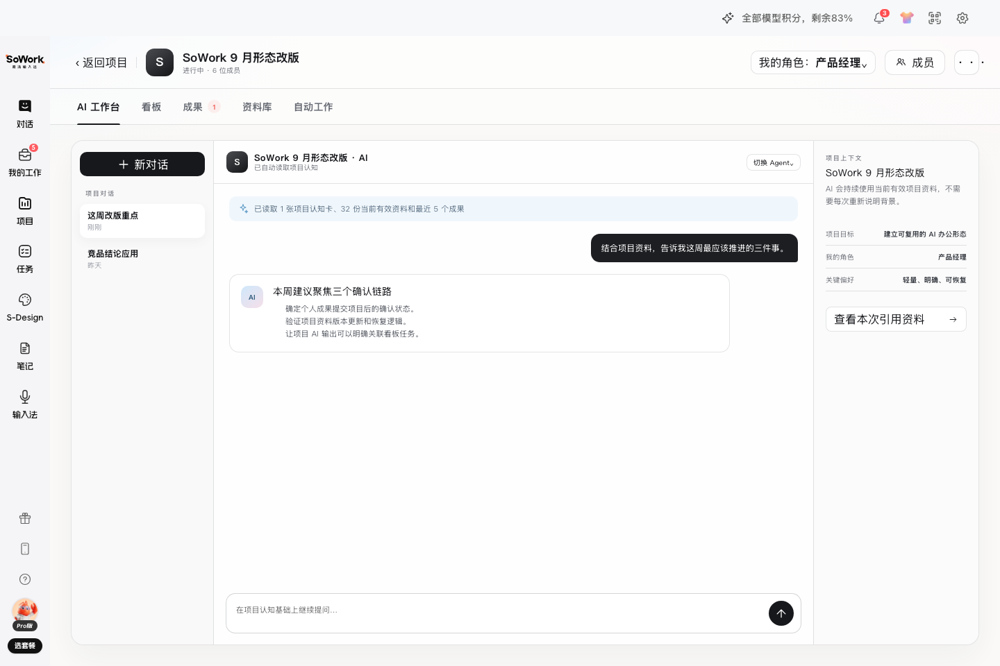
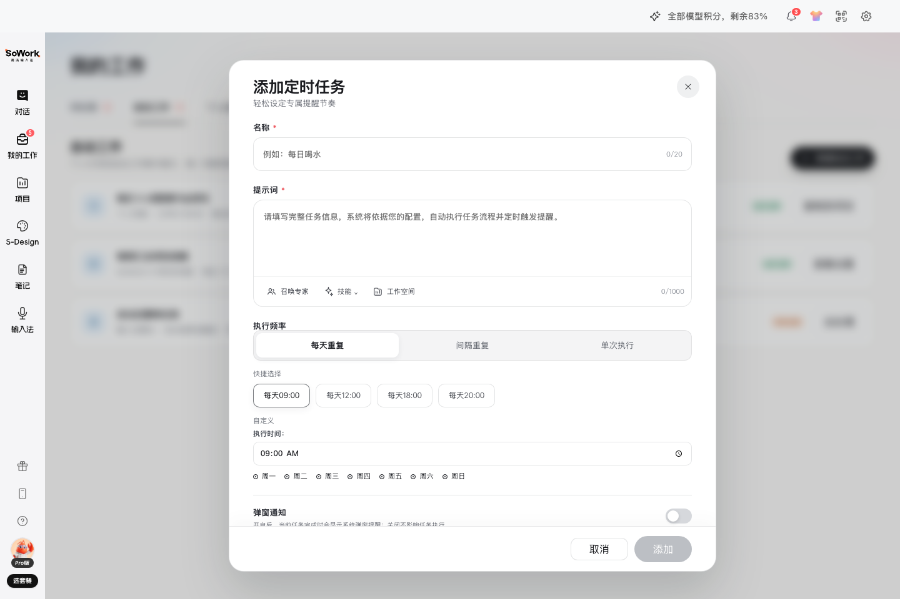
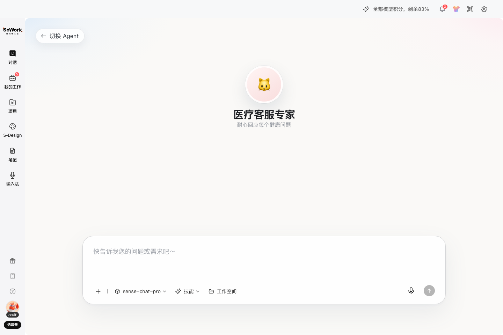
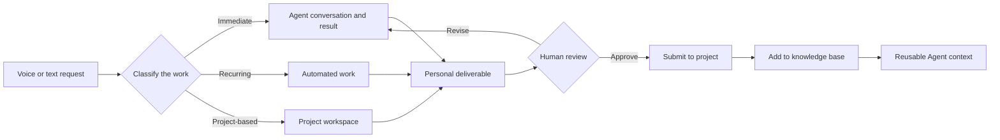

# 语音优先桌面工作 Agent | Voice-First Desktop Work Agent

[English Version](#english-version)

> 一个以语音输入为高频入口、以个人工作管理为核心服务的客户端 Agent 产品方案。本项目由我独立完成产品结构、核心工作流与高保真交互原型。

## 项目目标

传统 AI 对话工具通常停留在“提问—回答”，而真实工作需要把输入继续转化为任务、自动执行、成果确认、项目协作和知识沉淀。本方案把语音入口、Agent 能力和个人工作台连接成一条连续链路，让用户可以从一句自然语言开始，完成工作的创建、跟进与归档。

| 设计维度 | 方案 |
| --- | --- |
| 产品定位 | 面向个人知识工作者的桌面 Agent 与工作管理中枢 |
| 核心入口 | 语音优先，同时保留文字、文件、技能和工作空间入口 |
| 主要对象 | 对话、待处理事项、自动工作、个人成果、项目与资料库 |
| Agent 机制 | 支持普通模式、Agent 群群、自定义 Agent、专家选择与上下文切换 |
| 工作闭环 | 输入需求 → 选择 Agent → 执行 → 成果确认 → 项目归档 → 后续复用 |
| 原型验证 | 通过本地模拟数据验证页面状态、跨模块同步、异常返回与完整交互路径 |

## 核心工作流

[查看完整产品工作流](./docs/product-workflow.md)

## 主要模块与设计取舍

| 模块 | 用户问题 | 设计回应 |
| --- | --- | --- |
| 语音与首页 | 打开客户端后如何最低成本开始工作 | 用居中的语音视觉入口承接自然语言输入，并将模式、模型、技能和工作空间放在同一输入区 |
| Agent 选择 | 不同任务需要不同专业能力 | 以可搜索的 Agent 选择器组织普通 Agent、Agent 群与自定义角色，减少切换成本 |
| 我的工作 | 任务、自动执行和成果散落在不同位置 | 用“待处理 / 自动工作 / 个人成果”三视图统一个人工作状态 |
| 自动工作 | 周期性任务需要持续执行与提醒 | 支持频率、时间、Agent、技能、工作空间和通知方式的组合配置 |
| 项目 | AI 输出难以进入长期协作语境 | 在项目中组织 AI 工作台、看板、成果、资料库与自动工作，并隔离项目上下文 |
| 成果治理 | AI 产出不应未经确认直接成为事实 | 设计“个人成果 → 项目待确认 → 确认 / 纳入资料库”的人工确认链路 |

## 界面展示

### 个人工作台

### 项目总览与项目内 AI 工作台

### 自动工作与自定义 Agent

## 我的职责与产出

- 独立完成产品定位、信息架构、模块拆分和关键对象关系设计。
- 设计语音输入、Agent 调度、自动工作、成果确认、项目协作和资料沉淀的端到端流程。
- 通过 vibecoding 制作高保真交互原型，并用本地模拟数据验证跨页面状态同步。
- 补充桌面端页面状态、交互反馈、空状态和异常返回路径，形成可评审的产品演示。

## 公开版本说明

这是面向招聘评审的公开作品集安全版，仅保留产品说明、工作流和筛选后的原型截图。可执行源码、原客户端 renderer、字体、样式及媒体资源未公开，因此本目录不提供可运行 Demo。公开内容用于展示我的产品设计与原型验证过程，不授予对第三方品牌或资源的再使用权。

[返回 vibecoding 项目目录](../README.md)

---

## English Version

> A desktop Agent concept that uses voice as a high-frequency input and personal work management as its core service. I independently designed the product structure, end-to-end workflows, and high-fidelity interaction prototype.

### Product Goal

Many AI tools stop at question and answer, while real work continues through task creation, execution, review, project collaboration, and knowledge capture. This concept connects voice input, Agent capabilities, and a personal workspace so that one natural-language request can become a trackable and reusable work item.

| Design area | Solution |
| --- | --- |
| Positioning | A desktop Agent and work-management hub for individual knowledge workers |
| Primary entry | Voice-first, with text, files, Skills, and workspace context available in the same composer |
| Core objects | Conversations, pending items, automated work, personal deliverables, projects, and knowledge assets |
| Agent model | Standard mode, Agent teams, custom Agents, expert selection, and context switching |
| Work loop | Request → Agent selection → execution → human review → project submission → reusable knowledge |
| Prototype validation | Local fixtures validate page states, cross-module synchronization, recovery paths, and complete interactions |

### Core Workflow

[Read the complete product workflow](./docs/product-workflow.md)

### Key Modules

| Module | User problem | Design response |
| --- | --- | --- |
| Voice and home | Starting work should require minimal setup | A central voice-led entry combines mode, model, Skills, files, and workspace context |
| Agent selection | Different work needs different expertise | A searchable selector organizes individual, team, and custom Agents |
| My Work | Tasks, recurring runs, and outputs are fragmented | Pending, automated, and personal-deliverable views create one personal work queue |
| Automated work | Recurring tasks need scheduling and delivery controls | Frequency, timing, Agent, Skill, workspace, and notification settings are configured together |
| Projects | AI output needs durable project context | Each project combines an AI workspace, board, deliverables, knowledge base, and automated work |
| Deliverable governance | AI output should not become accepted knowledge automatically | A human-controlled personal deliverable → project review → knowledge-base workflow |

### My Role and Deliverables

- Independently defined the positioning, information architecture, modules, and relationships between core objects.
- Designed the end-to-end voice input, Agent routing, automated work, deliverable review, project collaboration, and knowledge-capture flows.
- Built a high-fidelity prototype through vibecoding and validated cross-page state synchronization with local fixtures.
- Specified desktop states, interaction feedback, empty states, and recovery paths for a reviewable demonstration.

### Public Edition

This is a recruitment-oriented, public-safe portfolio edition containing product documentation, the workflow, and selected prototype screenshots only. Executable source code and the original client renderer, fonts, styles, and media are intentionally excluded, so no runnable demo is provided here. The material demonstrates my product-design and prototyping process and does not grant reuse rights for third-party brands or assets.

[Back to vibecoding projects](../README.md)
