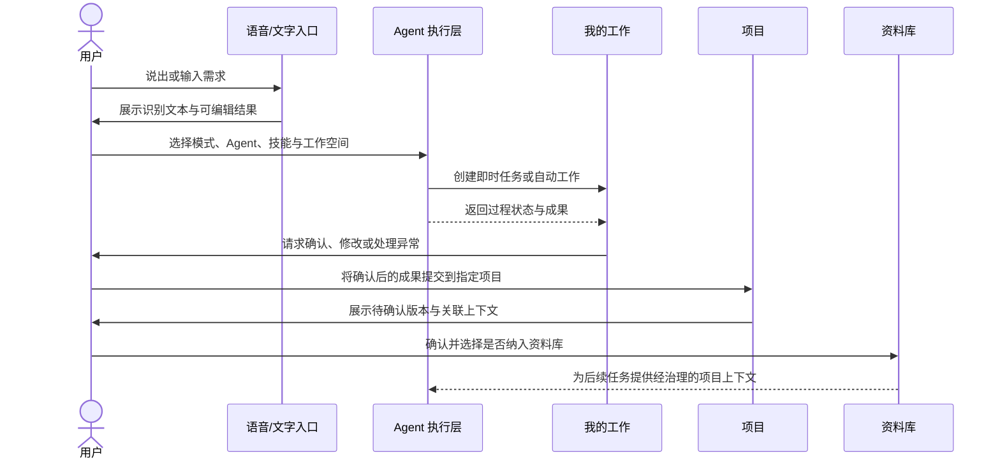
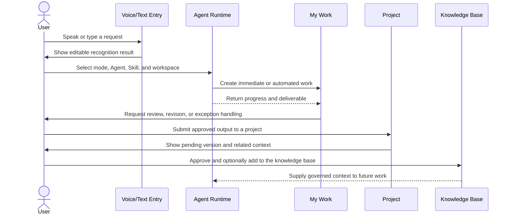

# 产品工作流 | Product Workflow

[English Version](#english-version)

## 1. 产品对象

| 对象 | 作用 | 关键状态 |
| --- | --- | --- |
| Request | 用户通过语音或文字提出的原始需求 | 草稿、已发送、处理中、已完成、失败 |
| Agent | 处理需求的个人 Agent、Agent 群或自定义专家 | 可用、运行中、等待输入、已停止 |
| Work Item | 从需求中形成的可执行事项 | 待处理、执行中、待确认、已完成、已逾期 |
| Automation | 按时间或周期运行的工作配置 | 启用、暂停、运行中、异常 |
| Deliverable | Agent 或用户形成的工作成果 | 个人成果、项目待确认、已确认、已归档 |
| Project | 长期目标、成员、上下文和成果的容器 | 进行中、维护中、已完成 |
| Knowledge Asset | 经用户确认后可供后续 Agent 使用的资料 | 草稿、已确认、已更新、已移除 |

## 2. 主链路



## 3. 语音输入流程

1. 用户从首页、任意工作模块或系统输入能力启动语音。
2. 产品提供明确的监听、识别、处理中和完成反馈，并允许在发送前修订识别文本。
3. 用户补充模型、Agent、Skill、文件和工作空间上下文。
4. 系统将需求判定为即时对话、持续任务或项目工作，并生成对应对象。
5. 权限不足、识别失败或网络异常时保留原始输入，允许重试或切换为文字。

## 4. 自动工作流程

```text
创建自动工作
  ├─ 填写目标与提示词
  ├─ 选择 Agent / Skill / 工作空间
  ├─ 设置单次、每日或间隔执行
  ├─ 选择通知与成果去向
  └─ 保存并进入“我的工作 > 自动工作”
          ↓
      到时自动执行
          ↓
   运行记录 / 异常提醒 / 成果
          ↓
       用户确认与归档
```

## 5. 成果治理流程

成果默认先属于个人，不直接成为项目事实。用户可以查看生成依据、继续对话修改、仅确认结果，或确认后提交至项目。项目收到成果后进入待确认区；只有经过用户明确操作，内容才会进入资料库，并成为后续 Agent 的可引用上下文。

这条链路用于解决三个问题：防止 AI 输出未经审核进入知识库、区分个人草稿和团队资产、保留成果从需求到归档的来源关系。

## 6. 项目内工作流

| 页面 | 主要任务 | 与其他模块的连接 |
| --- | --- | --- |
| AI 工作台 | 基于项目上下文继续提问、执行或修改成果 | 读取资料库；生成成果；切换项目 Agent |
| 看板 | 跟踪任务状态与负责人 | 接收待处理事项；反映执行结果 |
| 成果 | 审核个人或 Agent 提交的结果 | 确认后可进入资料库 |
| 资料库 | 管理经确认的长期项目知识 | 为 AI 工作台提供受控上下文 |
| 自动工作 | 管理项目内周期性 Agent 工作 | 输出进入成果确认链路 |

## 7. 原型验证范围

- 从首页进入普通 Agent、Agent 群、自定义 Agent 和专家选择。
- 在“我的工作”间切换待处理、自动工作与个人成果。
- 创建、复制、暂停和恢复自动工作。
- 创建项目、进入项目 AI 工作台并查看独立项目状态。
- 将个人成果提交到项目，确认后选择是否纳入资料库。
- 验证刷新后的本地状态、空状态、关闭返回和异常恢复路径。

公开作品集版本不包含可执行实现；上述流程来自已完成的高保真本地原型验证。

---

## English Version

### 1. Product Objects

| Object | Purpose | Key states |
| --- | --- | --- |
| Request | A voice or text request from the user | Draft, sent, processing, completed, failed |
| Agent | An individual, team, or custom expert that handles work | Available, running, waiting for input, stopped |
| Work Item | An actionable item derived from a request | Pending, in progress, awaiting review, completed, overdue |
| Automation | A scheduled or recurring work configuration | Enabled, paused, running, exception |
| Deliverable | An output created by an Agent or the user | Personal, pending project review, approved, archived |
| Project | A container for long-term goals, people, context, and outputs | Active, maintenance, completed |
| Knowledge Asset | User-approved material available to future Agents | Draft, approved, updated, removed |

### 2. Main Journey



### 3. Voice Input

1. Start voice input from home, a work module, or the system-level input entry.
2. Show explicit listening, recognition, processing, and completion states, with editable transcription before submission.
3. Add model, Agent, Skill, file, and workspace context.
4. Route the request to an immediate conversation, ongoing work item, or project workflow.
5. Preserve the original input on permission, recognition, or network failure so the user can retry or switch to text.

### 4. Automated Work

```text
Create automated work
  ├─ Define goal and instructions
  ├─ Select Agent / Skill / workspace
  ├─ Set one-time, daily, or interval execution
  ├─ Choose notification and output destination
  └─ Save to My Work > Automated Work
            ↓
      Scheduled execution
            ↓
     Run history / alert / output
            ↓
        Human review and archive
```

### 5. Deliverable Governance

Outputs begin as personal deliverables rather than project facts. A user can inspect the basis, continue the conversation, revise the output, approve it, or submit it to a project. Project submissions enter a pending-review area, and only an explicit user action can add them to the knowledge base for future Agent use.

This separates drafts from shared assets, prevents unreviewed AI output from becoming accepted knowledge, and preserves traceability from the original request through final archival.

### 6. Project Workflow

| Page | Primary job | Connections |
| --- | --- | --- |
| AI Workspace | Ask, execute, or revise with project context | Reads knowledge; produces deliverables; switches project Agents |
| Board | Track work state and ownership | Receives work items and reflects results |
| Deliverables | Review user- or Agent-generated outputs | Approved items can enter the knowledge base |
| Knowledge Base | Manage approved, durable project knowledge | Supplies governed context to the AI workspace |
| Automated Work | Manage recurring Agent work in a project | Sends outputs into the review flow |

### 7. Prototype Validation Scope

- Enter standard, team, custom, and expert Agents from the home experience.
- Switch among pending, automated, and personal-deliverable views in My Work.
- Create, duplicate, pause, and resume automated work.
- Create projects, enter the project AI workspace, and maintain isolated project state.
- Submit a personal deliverable to a project and optionally add an approved result to the knowledge base.
- Verify persisted local state, empty states, close-and-return behavior, and recovery paths.

The public portfolio edition excludes executable implementation; these flows were validated in the completed high-fidelity local prototype.
